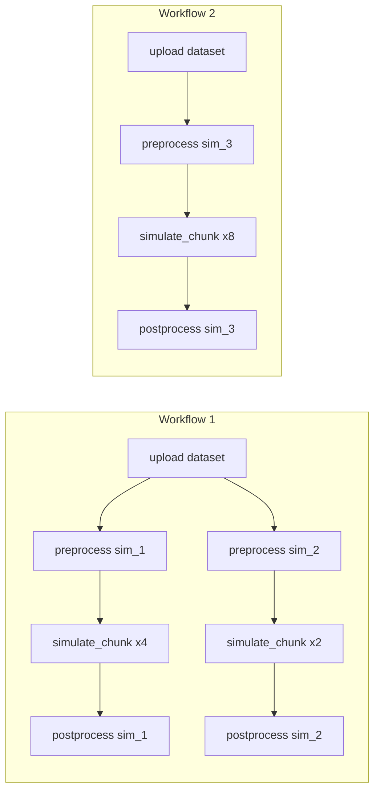

# Architecture

## Branch Structure

Each branch reimplements the same simulation scenario with a different engine:

| Branch | Engine | Transactional | Runtime Task DAG |
|---|---|---|---|
| `main` | procrastinate | YES | NO (polling) |
| `feat/dbos` | DBOS Transact | YES | YES (native) |
| `feat/temporal` | Temporal SDK | NO | YES (retry polling) |
| `feat/prefect` | Prefect 3 | NO | YES (retry task) |
| `feat/outbox-cdc` | Debezium + Kafka | YES | NO (polling) |

## Task DAG

Workflows are emergent connected components of the task DAG, defined by reachability:



## Decision Axes

```
                    Transactional Scheduling
                    YES                 NO
                 +--------------+-------------------+
   Runtime  YES  |    DBOS      |   Temporal        |
   Task DAG      |  (native)    |   Prefect         |
                 +--------------+-------------------+
            NO   | procrastinate|   Celery          |
                 |              |   Dramatiq        |
                 |              |   RQ              |
                 |              |   Huey            |
                 +--------------+-------------------+
```

Outbox + CDC = architectural bridge that moves ANY engine from the right column to the left.

## API Contract

All branches implement these endpoints identically:

| Method | Path | Description |
|---|---|---|
| POST | `/datasets` | Upload file, returns `{id, status: "pending"}` |
| GET | `/datasets/{id}` | Returns `{id, filename, status, created_at}` |
| POST | `/simulations` | `{dataset_id, parameters: {chunks: N}}`, returns `{id, status: "pending"}` |
| GET | `/simulations/{id}` | Returns `{id, dataset_id, status, result, parameters, created_at}` |

The `POST /simulations` does NOT wait for the dataset to be ready. It schedules
the simulation immediately and the engine handles the dependency internally.
No 409.

## Dependency Mechanisms per Branch

| Branch | How `simulation → dataset` dependency is expressed |
|---|---|
| `main` | `preprocess` task polls `dataset.status` in a loop (1s sleep, 60 max) |
| `feat/dbos` | `DBOS.recv()` blocks until `DBOS.set_event()` fires |
| `feat/temporal` | `wait_dataset_activity` raises → Temporal retry with backoff |
| `feat/prefect` | `wait_dataset_task` raises → Prefect retry with backoff |
| `feat/outbox-cdc` | Consumer handler polls `dataset.status` in a loop |

## Infrastructure per Branch

| Branch | Docker Services |
|---|---|
| `main` | postgres, server, worker |
| `feat/dbos` | postgres, server, worker |
| `feat/temporal` | postgres, temporal-postgres, temporal, temporal-ui, server, worker |
| `feat/prefect` | postgres, prefect-postgres, prefect-server, server, worker |
| `feat/outbox-cdc` | postgres, zookeeper, kafka, connect, server, worker |

## Key Tests per Branch

| Branch | Test | What it proves |
|---|---|---|
| `main` | `test_transactional.py` | rollback cancels procrastinate job |
| `feat/dbos` | `test_transactional.py` | rollback cancels DBOS workflow |
| `feat/temporal` | `test_consistency_gap.py` | DB committed but workflow not started |
| `feat/prefect` | `test_consistency_gap.py` | DB committed but flow not started |
| `feat/outbox-cdc` | `test_transactional.py` | rollback cancels outbox event + business row |
