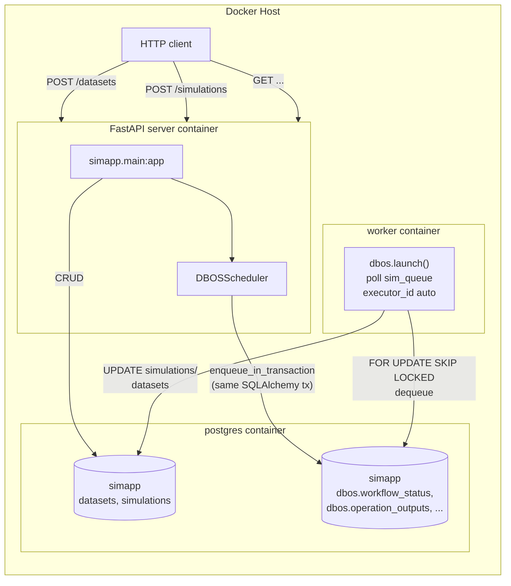

# DBOS Architecture

Deep architectural analysis of the DBOS-based solution for the simulation
scenario. This document covers how DBOS works internally, what topology we
run, how it behaves under failure, and how to operate it on the MIT
open-source library only — no Conductor.

**Scope:** everything here uses `dbos-transact-py` (MIT) + your own Postgres.
`DBOS_CONDUCTOR_KEY` is never set. See
[`../comparison-report.md`](../comparison-report.md) for the engine-selection
rationale.

---

## 1. Internal Mechanics

### 1.1 Execution model

DBOS implements **durable execution** as a library, not a server. There is no
orchestrator process, no broker, no Raft cluster. The engine is a Python
package in your application process that:

1. Registers workflow/step function references in-process at import time.
2. Checkpoints each workflow's inputs and each step's output to Postgres
   (the **system database**) as they complete.
3. Polls Postgres-backed **queues** to pick up enqueued workflows.
4. On process start, re-invokes any `PENDING` workflows assigned to its
   executor ID, replaying checkpointed steps instead of re-running them.

The critical consequence: **Postgres is the single source of truth.** There
is no separate state that can diverge. If you can backup Postgres, you have
backed up the entire engine state.

### 1.2 The system database

DBOS stores its internal tables in a dedicated `dbos` schema. In our
deployment (`feat/dbos` branch) both the application data and the DBOS
system tables live in the same logical `simapp` database (system DB URL =
app DB URL) on a single Postgres 17 server (same Docker container).

- `simapp` — application data (datasets, simulations) and DBOS system
  tables (`dbos.workflow_status`, `dbos.operation_outputs`, queue state,
  event/mailbox tables)

DBOS system tables are created automatically by `dbos.launch()` in the same
simapp database — there is no separate system database to provision and no
init script. Sharing one logical database simplifies deployment: a single
connection string, a single dump/restore, and `enqueue_in_transaction` can
bind the workflow-row insert into the caller's transaction without crossing
database boundaries. The trade-off is that the app schema and the engine
tables share the same logical database, so engine tables sit alongside the
domain model.

Key system tables:

| Table | Contents |
|---|---|
| `dbos.workflow_status` | One row per workflow invocation: ID, name, status (`PENDING`/`SUCCESS`/`ERROR`), inputs, output, executor ID, queue name |
| `dbos.operation_outputs` | Step checkpoints: workflow UUID → step function ID → serialized return value |
| `dbos.notifications` / event tables | Backing storage for `DBOS.send`/`DBOS.recv`, `DBOS.set_event`/`DBOS.get_event` |
| `dbos.scheduler_state` | Queue polling state, rate/concurrency limiter bookkeeping |

This is all documented SQL — you can query it directly for observability.

### 1.3 Workflows and steps

```python
@DBOS.step()
def _simulate_chunk_step(simulation_id: str, chunk_index: int) -> dict:
    DBOS.sleep(1)
    return {"chunk_index": chunk_index, "value": chunk_index * 2}

@DBOS.workflow()
def simulation_wf(simulation_id: str, dataset_id: str, chunks: int) -> str:
    _preprocess_step(simulation_id)
    DBOS.get_event(f"dataset-{dataset_id}", "ready", timeout_seconds=120)
    handles = [sim_queue.enqueue(_simulate_chunk_step, simulation_id, i)
               for i in range(chunks)]
    results = [h.get_result() for h in handles]
    _postprocess_step(simulation_id, results)
    return "completed"
```

Two hard rules come from the recovery mechanism (§1.4):

1. **Workflow bodies must be deterministic.** A workflow function is
   re-executed during recovery; everything side-effecting (DB writes, HTTP,
   `time.time()`, `random`) must be inside `@DBOS.step()` so the replay can
   substitute the checkpointed output. If a workflow body's control flow
   depends on a non-deterministic value, recovery will diverge.

2. **Steps should be idempotent.** A step that was executing when the process
   died will be re-run from the start (its checkpoint never landed). Our
   steps satisfy this: `_process_dataset_step` does `UPDATE datasets SET
   status='ready'` (idempotent), chunk steps are pure sleep+return,
   `_postprocess_step` overwrites the result row (idempotent because it's a
   full-row upsert, not an append).

### 1.4 Recovery: exactly-once over at-least-once

DBOS does not promise exactly-once step execution; it promises
**exactly-once workflow completion** built on at-least-once step execution:

- If a step's checkpoint transaction commits, the step will never re-run.
- If the process dies mid-step, the checkpoint is lost, and the step re-runs
  on recovery. Hence the idempotency requirement.

Recovery on a single executor is automatic on `dbos.launch()` — the process
scans `workflow_status` for `PENDING` rows with its executor ID, re-invokes
each workflow function with its checkpointed inputs, and each step checks
`operation_outputs` before running. The first step with no checkpoint is
where real work resumes.

### 1.5 Queues

`DBOS.register_queue("sim_queue", concurrency=10)` declares a named Postgres-backed queue
with a per-process concurrency limit of 10 concurrent workflows. Execution
flow:

1. A producer calls `queue.enqueue(fn, *args)` or
   `DBOSClient.enqueue_in_transaction(session, options, *args)`.
2. The library inserts a `PENDING` row into `workflow_status` tagged with the
   queue name.
3. Every running DBOS process that has registered this queue polls it, claims
   rows (respecting its concurrency budget), and executes them.
4. Worker-side dequeuing uses row-level locking (`FOR UPDATE SKIP LOCKED`
   semantics under the hood) so multiple executors can share one queue
   without double-claiming.

Flow control is per-queue per-process. In our single-worker topology,
`concurrency=10` means at most 10 simulations/dataset processings run
concurrently in that container.

### 1.6 Inter-workflow dependency: `set_event` / `get_event`

The primitive that makes our scenario work without API-layer polling:

```python
# In process_dataset_wf (the producer):
DBOS.set_event("ready", "ready")

# In simulation_wf (the consumer):
DBOS.get_event(f"dataset-{dataset_id}", "ready", timeout_seconds=120)
```

`set_event` writes a durable key-value entry to the system database (within
the workflow's transaction context), keyed on the producer's workflow ID.
`get_event` blocks — **durably** — on a target workflow ID + key until the
key exists or the timeout expires. If the consumer workflow crashes while
blocked, recovery re-invokes it and `get_event` re-executes: if the event
has since been set, it returns immediately; otherwise it keeps waiting. This
is a native engine-level wait, not application-level sleep-polling.

`workflow_id` determinism: we pass explicit IDs (`dataset-<uuid>`,
`simulation-<uuid>`). DBOS treats same-ID enqueues as idempotent — a second
enqueue with an existing workflow ID is a no-op. That's our protection
against double-submission from retried HTTP requests.

### 1.7 Transactional enqueue

The headline feature for our use case:

```python
class DBOSScheduler:
    def __init__(self):
        self._client = DBOSClient(system_database_url=_system_db_url)

    def schedule_dataset_processing(self, session: Session, dataset_id, filename):
        options: EnqueueOptions = {
            "queue_name": "sim_queue",
            "workflow_name": "process_dataset_wf",
            "workflow_id": f"dataset-{dataset_id}",
        }
        self._client.enqueue_in_transaction(session, options, str(dataset_id), filename)
```

`enqueue_in_transaction` reuses the caller's SQLAlchemy `Session` connection
to insert the workflow row into the system DB's `workflow_status` table.
It participates in the same database transaction as the business writes.

**The catch.** This only works atomically because in our deployment the app
DB and the system DB are the same physical Postgres instance — but standard
Postgres does not allow a single connection to span two databases. What
happens instead: DBOS opens a *separate* connection to the simapp database
and issues the insert there, binding that separate connection into the caller's
transaction lifecycle. DBOS hooks the operation into the caller's SQLAlchemy
session so the insert into `workflow_status` is committed or rolled back by
the same transaction manager that drives the caller's session — the two
either both commit or both roll back. This is why `enqueue_in_transaction`
takes the active `Session` as its first argument: it ties the secondary
connection's fate to the caller's transaction boundary.

**Practical consequence for us:** rollback of the request-level transaction
cancels the enqueue — which is exactly what `tests/test_transactional.py`
proves. The reverse (app-row committed, enqueue lost) cannot happen, and
there is no `on_commit` hook gap as with Celery/Temporal.

---

## 2. Our Topology

### 2.1 Services



Two processes (`server`, `worker`) share one Postgres. The worker just runs
`dbos.launch()` and blocks; there's no separate scheduler, no message broker,
no orchestrator. The web process can also execute workflows in-process
(DBOS doesn't care), but we keep a dedicated worker for cleanliness.

### 2.2 Request lifecycle

**POST /datasets:**

1. FastAPI handler opens a SQLAlchemy session.
2. `INSERT INTO datasets (status='pending')`.
3. `DBOSScheduler.schedule_dataset_processing(session, ...)` — inserts
   `PENDING` row into `simapp.dbos.workflow_status` **inside the same
   transaction**.
4. Commit — atomically: dataset row + workflow row.
5. Return 201 with `{id, status: "pending"}`.
6. Worker process polls `sim_queue`, claims the workflow, runs
   `process_dataset_wf`:
   - `_process_dataset_step`: sleep 2s, `UPDATE datasets SET status='ready'`.
   - `DBOS.set_event("ready", "ready")`.

**POST /simulations:**

1. FastAPI inserts simulation row (status `pending`) + enqueues
   `simulation_wf`, same in-tx pattern. Note **no check that the dataset is
   ready** — this was the design change that removed the 409 gate. The
   engine handles ordering.
2. Worker picks up the workflow:
   - `_preprocess_step`: set simulation status to `running`.
   - `DBOS.get_event(f"dataset-{dataset_id}", "ready", timeout_seconds=120)` — blocks until
     the dataset workflow signals, or fails the workflow after 120 s.
   - `sim_queue.enqueue(_simulate_chunk_step, ...)` × N — dynamic fan-out,
     N from runtime parameters.
   - `h.get_result()` for each handle — fan-in (each is a separate workflow
     invocation of the step, checkpointed individually).
   - `_postprocess_step`: aggregate, `UPDATE simulations SET
     status='completed', result=...`.

### 2.3 Why no Conductor

Conductor would give us: cross-executor auto-recovery, a workflow dashboard,
pause/restart UI, retention policies, Prometheus metrics. None of these
matter for the current scope:

- **Single worker container.** If it dies, Docker restarts it; on
  `dbos.launch()` it recovers its own `PENDING` workflows. That's the
  entire recovery story.
- **Dashboard.** We query `dbos.workflow_status` directly (see §4.2). Our
  workflows are short-lived (< 1 min); a dashboard is overkill.
- **Retention.** Postgres disk is cheap; we'll add `DELETE FROM
  dbos.workflow_status WHERE status='SUCCESS' AND created_at < now() -
  interval '30 days'` as a cron if ever needed.
- **License.** Self-hosted Conductor requires a paid key for production use
  and is limited to one executor on the free dev key. Hosted Conductor is
  $99+/mo. Neither adds value here.

---

## 3. Scaling Path

The architecture scales without redesign:

| Load increase | Change | Infra delta |
|---|---|---|
| 1 worker (current) | — | postgres + server + worker |
| Worker CPU-bound | `docker compose up -d --scale worker=N` | none — queue handles distribution |
| Postgres I/O-bound | Bigger instance, or split `sim_queue` into per-type queues | none |
| Beyond 1 Postgres | Shard by tenant across multiple Postgres hosts, one system DB per shard | replication of compose stack |
| Multi-host workers | Give each worker process an explicit `executor_id` in config | none |

Throughput ceiling: the architecture doc cites >40K workflows or steps per
second sustained on a single Postgres. The simulation workload (a few
workflows per HTTP request) is orders of magnitude below that.

One real constraint: **all processes of an application must use the same
programming language** (Python here). Cross-language interaction requires
the DBOS Client from another service — which can only enqueue and observe,
not execute steps.

---

## 4. Operating Without Conductor

### 4.1 Recovery playbook

**Normal restart** (deploy, OOM, crash): nothing to do. Docker restarts the
container; `dbos.launch()` recovers `PENDING` workflows for its executor ID.

**Worker is permanently lost** (host dies, we scaled down): assign a new
container the same `executor_id` in config, or run the recovery sweep
manually:

```sql
-- Find stale PENDING workflows (executor dead for >N minutes)
SELECT workflow_uuid, name, inputs, started_at_epoch_ms
FROM dbos.workflow_status
WHERE status = 'PENDING'
  AND executor_id NOT IN (< live executor ids >)
  AND started_at_epoch_ms < extract(epoch from now() - interval '5 minutes') * 1000;
```

Then reset `status='PENDING'` and clear `executor_id` on those rows; any
live DBOS process will pick them up on its next poll. In the single-worker
deployment this is a non-event.

### 4.2 Observability without the dashboard

Handy queries against `simapp`:

```sql
-- Currently running
SELECT workflow_uuid, name, status,
       to_timestamp(started_at_epoch_ms/1000) AS started
FROM dbos.workflow_status
WHERE status='PENDING'
ORDER BY started_at_epoch_ms DESC;

-- Failures in last hour
SELECT workflow_uuid, name, error,
       to_timestamp(started_at_epoch_ms/1000)
FROM dbos.workflow_status
WHERE status='ERROR'
  AND started_at_epoch_ms > extract(epoch from now()-interval '1 hour')*1000;

-- Throughput (workflows/min over last 10 min)
SELECT date_trunc('minute', to_timestamp(started_at_epoch_ms/1000)) AS minute,
       count(*)
FROM dbos.workflow_status
WHERE started_at_epoch_ms > extract(epoch from now()-interval '10 minutes')*1000
GROUP BY 1 ORDER BY 1 DESC;

-- Step-level timing for one workflow
SELECT function_id, output,
       to_timestamp(recorded_at_epoch_ms/1000)
FROM dbos.operation_outputs
WHERE workflow_uuid='<uuid>'
ORDER BY recorded_at_epoch_ms;
```

For metrics, `dbos.workflow_status` is append-mostly; a scheduled
`pg_stat_statements`-style rollup view suffices.

### 4.3 Versioning of workflow code

Breaking changes to a workflow (different steps, different order) break
recovery of in-flight workflows started on the old code. DBOS supports
patching and application versioning. Our mitigation:

- Set `application_version` in `DBOSConfig` to the git SHA on deploy.
- During development, accept that in-flight workflows may fail recovery and
  surface in the ERROR query above — they're re-submittable via the API.
- For any serious deployment, follow the patching pattern documented in
  DBOS's upgrade tutorial (annotate conditionals, never reorder steps for
  in-flight workflows).

### 4.4 Idempotency guarantees we must preserve

| Step | Idempotent? | Why |
|---|---|---|
| `_process_dataset_step` | ✅ | `UPDATE datasets SET status='ready'` — same result on retry |
| `_preprocess_step` | ✅ | `UPDATE simulations SET status='running'` — idempotent state transition |
| `_simulate_chunk_step` | ✅ | Pure compute + return |
| `_postprocess_step` | ✅ | Overwrites `simulations.result` wholesale |

If we ever add "append row," "send email," or "call external API" steps,
they need their own dedup mechanism (e.g., a `processed_steps` table keyed
by workflow UUID + step name).

---

## 5. Failure Modes

| Failure | Behavior | User-visible effect |
|---|---|---|
| Server crash mid-request | Transaction rolls back | Client sees connection error, retries safely (no partial writes) |
| Worker crash mid-step | Step reruns on worker restart | Simulation takes a few extra seconds |
| Worker crash between steps | Workflow resumes from last checkpointed step | No visible effect |
| Postgres restart | All DBOS processes reconnect, polling resumes | Brief delay; nothing lost |
| `get_event` timeout (120 s) | Workflow marked ERROR, simulation left in `running` | Frontend shows `running` forever — needs a reconciliation task or frontend timeout UX |
| Duplicate enqueue (e.g., client retry) | Second enqueue with same `workflow_id` is a no-op | None — idempotent by design |
| System DB connection lost | `dbos.launch()` retries; workflows not recovered until restored | Treated as worker-down scenario |

The `get_event` timeout is the one rough edge: after a timeout, `simulation_wf`
fails but the application `simulation.status` stays `running` because
`_postprocess_step` never ran. Options:

1. Wrap the get_event in a try/except inside the workflow, write a failed status
   to the simulations table on timeout (preferred — deterministic, owned
   by us).
2. A janitor task that periodically scans `simapp.dbos.workflow_status`
   for ERROR and reconciles `simulations.status`.
3. Surface the timeout UX-side ("simulation timed out waiting for dataset").

This is flagged as known follow-up work, not yet implemented on the branch.

---

## 6. Comparison With What We Rejected

The DBOS architecture replaces what other engines need as separate
infrastructure:

| Component | Temporal | Prefect | Celery | **DBOS** |
|---|---|---|---|---|
| Orchestrator server | ✅ required | ✅ required | — | **library** |
| Message broker | internal | internal | Redis/RabbitMQ | **Postgres** |
| Result/checkpoint store | Cassandra | own Postgres | Redis | **Postgres** |
| UI/dashboard | temporal-ui container | prefect-server container | Flower (separate) | **Conductor (optional, paid)** |
| App database | yours | yours | yours | **yours** |
| Extra infra services | 4 (server, UI, cassandra, ES) | 2 (server, PG) | 2 (broker, result) | **0 — just your existing PG** |

The MIT library gives us Temporal-class workflow durability with procrastinate-class infrastructure.

---

## 7. Known Tradeoffs

Honest list, so we're not surprised later:

1. **Postgres is the bottleneck.** Every step = 1 write. Every workflow = +2
   writes. Under heavy fan-out (1000 chunks), a single simulation costs 1002
   checkpoint writes. For our scale this is noise; at 10K chunks/s it
   requires Postgres tuning.

2. **Checkpoint size.** Step outputs are serialized into `operation_outputs`.
   Returning large payloads (multi-MB arrays, file contents) from steps
   bloats the system DB. Put large artifacts in object storage, pass
   pointers (`{"s3_key": "..."}`). Our chunks return tiny dicts, so
   unaffected.

3. **Determinism discipline is on us.** No sandboxing, no replay checker
   (Temporal's workflow sandbox enforces this; DBOS trusts you). A careless
   `datetime.now()` in a workflow body silently breaks recovery.

4. **No native UI.** The Conductor dashboard is nice-to-have for debugging.
   Without it, errors are SQL queries. Fine for developers, awkward for
   ops/support staff.

5. **Ecosystem maturity.** DBOS is young (Series A startup, initial release
   2024). The Python SDK is solid, but Stack Overflow coverage is thin and
   there are sharp edges the community hasn't hit yet. MIT license + plain
   Postgres tables means we're never stuck — worst case, we write our own
   recovery sweeper and keep the checkpoints.

6. **Cross-language is constrained.** If the backend ever grows a
   non-Python service that needs to execute workflows (not just enqueue),
   it can't. It would have to call into a Python worker via the DBOS
   Client or HTTP. Not a concern for this project.

7. **`get_event` timeout leaves app state inconsistent** (§5). Needs a small
   amount of application-side reconciliation we haven't written yet.

---

## 8. Decision

For this project — simulation workloads of minutes, single-digit workers,
existing Postgres, no appetite for new expenses or infrastructure — DBOS on
the MIT library is the right choice. The two requirements that drove the
engine comparison (transactional scheduling, runtime task DAG) are both
satisfied natively, with operational complexity identical to the
procrastinate baseline we were already comfortable with.

The recommendation is:

- ✅ Adopt `feat/dbos` as the reference implementation.
- ✅ Do not set `DBOS_CONDUCTOR_KEY`.
- ✅ Add the failed-`get_event` reconciliation (§5 option 1) before treating this
  as production-ready.
- ✅ Set `application_version` from git SHA at build time.
- ⏸️ Re-evaluate Conductor if we ever scale past ~3 worker containers or
  need human workflow intervention (pause/resume UI).
