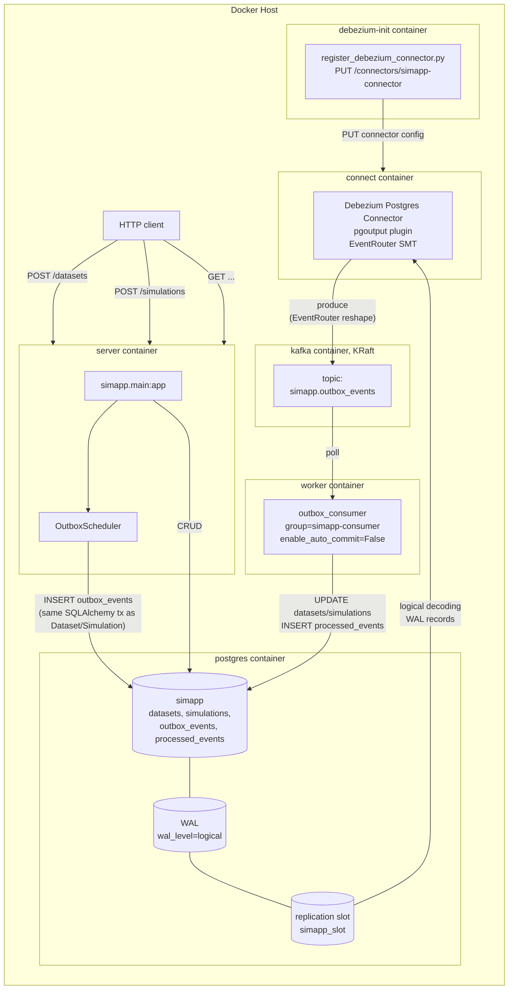

# Outbox-CDC Architecture

Deep architectural analysis of the Debezium + Kafka solution for the simulation
scenario. This document covers how the Transactional Outbox pattern works
internally, what topology we run, how it behaves under failure, and how to
operate it on the open-source Debezium 3.6 + Kafka 3.6 stack, no proprietary
control plane.

**Scope:** everything here uses Debezium's Postgres connector, the EventRouter
single-message transform, Kafka in KRaft mode, and a hand-written Python
consumer (`src/simapp/outbox_consumer.py`). No Confluent Server, no Schema
Registry, no Kafka Connect UI. See
[`../comparison-report.md`](../comparison-report.md) for the engine-selection
rationale and why this branch is the **bridge** pattern rather than a
standalone engine.

The central narrative of this branch is the Transactional Outbox pattern. It
is not a workflow engine. It is the architectural bridge that makes any
engine's enqueue step transactional with your business writes, by moving the
"intent to do work" out of an in-memory queue and into a row in the same
Postgres transaction that holds the business data. CDC then relays that row to
Kafka where any consumer, in any language, can pick it up.

---

## 1. Internal Mechanics

### 1.1 Execution model

The Transactional Outbox pattern splits the "schedule work" step from the
"execute work" step across a durable boundary. The producer does not call a
worker. The producer writes a row. The row becomes the work order, and a
separate relay reads it later.

Concretely, on this branch:

1. The FastAPI handler opens a SQLAlchemy session, inserts the business row
   (a `Dataset` or `Simulation`) and, in the same transaction, inserts an
   `OutboxEvent` row describing the work to do.
2. Postgres commits the transaction. The `outbox_events` row now exists on
   disk. The WAL entry for that insert is what the rest of the pipeline
   reads. The producer's job is finished. It returns 201 to the client.
3. The Debezium Postgres connector, attached to a logical replication slot,
   sees the WAL record. The `pgoutput` plugin decodes it into a change event.
   The EventRouter single-message transform reshapes that change event into
   a clean event message (payload only, no Debezium envelope cruft) and
   routes it to the `simapp.outbox_events` Kafka topic.
4. The Python consumer, subscribed to that topic with
   `enable_auto_commit=False`, polls the topic, dispatches the event to the
   right handler, records the event ID in the `processed_events` ledger, and
   only then commits the Kafka offset.

The critical consequence is identical to DBOS but arrived at from the
opposite direction: **Postgres is the single source of truth.** The work
order is a row in the same database as the business data, written in the
same transaction. There is no in-memory queue that can lose an enqueue, no
"fire after commit" gap where the worker is told to start but the producer
silently died before it could send the message.

### 1.2 Persistence: the app database is the engine database

There is no separate engine database on this branch. The application's
Postgres 17 server, the same one that holds `datasets` and `simulations`,
holds `outbox_events` and `processed_events` too. The only operational
requirement that distinguishes this Postgres from a vanilla install is the
`wal_level=logical` setting plus replication slot capacity, which the
`docker-compose.yml` postgres service sets explicitly:

```yaml
postgres:
  image: postgres:17.10
  environment:
    POSTGRES_USER: simapp
    POSTGRES_PASSWORD: simapp
    POSTGRES_DB: simapp
  ports:
    - "5432:5432"
  volumes:
    - pgdata:/var/lib/postgresql/data
  command:
    - "postgres"
    - "-c"
    - "wal_level=logical"
    - "-c"
    - "max_replication_slots=4"
    - "-c"
    - "max_wal_senders=4"
  healthcheck:
    test: ["CMD-SHELL", "pg_isready -U simapp -d simapp"]
    interval: 3s
    timeout: 3s
    retries: 10
```

`wal_level=logical` is what makes the WAL stream decodable into row-level
change events. Without it, the WAL only contains page-level diffs, useless
for CDC. `max_replication_slots=4` and `max_wal_senders=4` raise the
defaults so a connector slot and standby connections can coexist with any
manual inspection slot you might add later.

Key tables on this branch:

| Table | Purpose | Created by |
|---|---|---|
| `datasets` | business data: uploaded files, status pending/ready/failed | Alembic `0001_initial` |
| `simulations` | business data: simulation runs, status pending/running/completed/failed | Alembic `0001_initial` |
| `outbox_events` | work orders: one row per intent to dispatch, picked up by Debezium | Alembic `0001_initial` |
| `processed_events` | idempotency ledger: Kafka event IDs already handled by the consumer | `scripts/post_migrate.py` (branch-specific, not in Alembic) |

The `outbox_events` table is the contract between the application and the
relay. Its columns are the input to the EventRouter SMT and the consumer's
dispatch logic:

```python
class OutboxEvent(Base):
    __tablename__ = "outbox_events"

    id: Mapped[uuid.UUID] = mapped_column(
        UUID(as_uuid=True), primary_key=True, default=uuid.uuid4
    )
    aggregate_type: Mapped[str] = mapped_column(String(255), nullable=False)
    aggregate_id: Mapped[str] = mapped_column(String(255), nullable=False)
    event_type: Mapped[str] = mapped_column(String(255), nullable=False)
    payload: Mapped[dict] = mapped_column(JSONB, nullable=False)
    created_at: Mapped[datetime] = mapped_column(
        DateTime(timezone=True), server_default=func.now(), nullable=False
    )
```

`id` is a UUID generated by the application, not by Postgres. That matters:
the EventRouter SMT lifts it into a Kafka header, and the consumer uses it as
the deduplication key. Generating it in the application means we know it
before the row exists, so the same ID flows from request through tx through
CDC through Kafka through consumer without ever being regenerated.

`aggregate_type` drives routing. The EventRouter SMT is configured with
`route.by.field=aggregate_type` so a future `dataset` vs `simulation`
split into separate topics would be a config change, not a code change.
Today both routes resolve to the single topic `simapp.outbox_events` via
the `route.topic.replacement=simapp.outbox_events` setting.

`aggregate_id` becomes the Kafka message key, which means Kafka guarantees
ordering per aggregate. Events for the same dataset or simulation land on
the same partition and are consumed in insertion order by the same consumer.

`event_type` is the consumer's dispatch key. The EventRouter SMT is told
both to use it as the message type and to also drop it into the envelope
via `table.fields.additional.placement=event_type:envelope:event_type`. The
consumer reads it from the message body and routes accordingly.

`payload` is JSONB on the Postgres side and is expanded by EventRouter's
`table.expand.json.payload=true` into real JSON on the Kafka side. The
consumer receives it already-parsed and dispatches by event type.

The `processed_events` table is intentionally not in Alembic. It is a
branch-specific addition that exists only on `feat/outbox-cdc`. The
`scripts/post_migrate.py` hook creates it via raw SQLAlchemy DDL, and the
consumer itself defensively recreates it on startup if missing:

```python
def apply_schema(engine) -> None:
    """Create branch-specific tables if they do not already exist."""
    with engine.begin() as conn:
        if not conn.dialect.has_table(conn, ProcessedEvent.__tablename__):
            conn.execute(
                CreateTable(
                    ProcessedEvent.__table__,
                )
            )
```

The consumer-side re-creation is a Docker safety net. The worker container
depends on `debezium-init` completing, not on `post_migrate.py` running, so
if the table somehow is not there, the consumer creates it on first boot
rather than crash-looping. The schema is trivial: a single UUID primary key
and a processed-at timestamp.

### 1.3 The CDC pipeline: Postgres to Kafka

The path from row insert to Kafka message is four hops:

1. **Postgres commit writes a WAL record.** `outbox_events` inserts go
   through the normal WAL machinery. `wal_level=logical` makes those
   records decodeable into logical change events, not just physical page
   diffs.
2. **The Debezium Postgres connector reads the WAL via a replication slot.**
   The slot, named `simapp_slot` in our config, is a durable cursor into the
   WAL. It survives Postgres restarts. It survives connector restarts. The
   connector reads from where it left off, never re-reading committed
   changes. WAL is retained until the slot has consumed it, which is the
   mechanism that prevents data loss when the connector is down (and is
   also the failure mode that can fill disk if the connector stays down too
   long, see §5).
3. **The `pgoutput` plugin decodes the WAL record.** Postgres 10+ ships
   `pgoutput` in the box. No extra shared library, no `wal2json` install.
   The plugin emits a logical change event for each insert/update/delete
   against `outbox_events` (the only table in our `table.include.list`).
4. **The EventRouter SMT reshapes the change event.** A raw Debezium change
   event is a verbose envelope: before/after images, source metadata, tx
   metadata, schema, payload. For an outbox event we want none of that. We
   want the payload only, routed to the right topic, with the event ID in a
   header for dedup. EventRouter does all of this in a single SMT chain
   entry.

The connector configuration lives inline in
`scripts/register_debezium_connector.py` rather than in a JSON file. This
keeps the entire CDC setup in one readable Python file and avoids a
"connector config in a separate JSON the deploy script reads" indirection.

The connector itself is the standard Debezium Postgres connector class, and
the slot and publication names are explicit so we can find them in
`pg_replication_slots` and `pg_publication` for operational inspection:

```python
return {
    "connector.class": "io.debezium.connector.postgresql.PostgresConnector",
    "database.hostname": "postgres",
    "database.port": "5432",
    "database.user": "simapp",
    "database.password": "simapp",
    "database.dbname": "simapp",
    "topic.prefix": "simapp",
    "plugin.name": "pgoutput",
    "slot.name": "simapp_slot",
    "publication.name": "simapp_pub",
    "table.include.list": "public.outbox_events",
    "tombstones.on.delete": "false",
    ...
}
```

The registration script blocks for up to 180 seconds waiting for the
connector to reach RUNNING state. If it does not, the script exits non-zero
and the `debezium-init` Docker service fails, which blocks the worker from
starting. There is no silent "connector might be registering" window where
the worker is consuming from an empty topic without realising the relay is
not actually connected.

### 1.4 The EventRouter SMT, line by line

The EventRouter SMT is the most complex piece of configuration on this
branch. Every key matters, so each one gets a sentence.

```python
    "transforms": "outbox",
    "transforms.outbox.type": "io.debezium.transforms.outbox.EventRouter",
    "transforms.outbox.table.field.event.id": "id",
    "transforms.outbox.table.field.event.key": "aggregate_id",
    "transforms.outbox.table.field.event.type": "event_type",
    "transforms.outbox.table.field.event.payload": "payload",
    "transforms.outbox.table.fields.additional.placement": "event_type:envelope:event_type",
    "transforms.outbox.table.expand.json.payload": "true",
    "transforms.outbox.route.by.field": "aggregate_type",
    "transforms.outbox.route.topic.regex": ".*",
    "transforms.outbox.route.topic.replacement": "simapp.outbox_events",
    "value.converter": "org.apache.kafka.connect.json.JsonConverter",
    "value.converter.schemas.enable": "false",
```

- `transforms=outbox` declares a single SMT in the chain, aliased `outbox`.
  There is no chain of multiple SMTs here; EventRouter does everything we
  need in one transform.
- `transforms.outbox.type` is the EventRouter implementation class. It only
  applies to records from the configured table, so it cannot accidentally
  reshape non-outbox changes.
- `transforms.outbox.table.field.event.id=id` tells EventRouter which
  outbox column to lift into the Kafka `id` header. The header is what the
  consumer reads to dedup. We use the application-generated UUID, so a
  redelivered event has the same `id` header on every delivery.
- `transforms.outbox.table.field.event.key=aggregate_id` makes the Kafka
  message key the aggregate ID. Same aggregate, same partition, same
  consumer, in-order delivery. Critical for any future per-aggregate state
  machine.
- `transforms.outbox.table.field.event.type=event_type` tells EventRouter
  which column carries the event type. This is metadata for routing inside
  the consumer, but it also gates EventRouter's "route by event type"
  feature which we are not using here (we route by aggregate type instead).
- `transforms.outbox.table.field.event.payload=payload` is the payload
  column. EventRouter discards everything else from the row and emits only
  this as the Kafka message value. The Debezium envelope does not reach
  Kafka.
- `transforms.outbox.table.fields.additional.placement=event_type:envelope:event_type`
  is in the `column:placement:alias` format. It says: take the `event_type`
  column, place it in the `envelope` under the alias `event_type`. Without
  this, `event_type` would only be used by EventRouter internally and would
  not appear in the message the consumer sees. With it, the consumer can
  read `event["event_type"]` from the message body, which is what
  `_dispatch` does.
- `transforms.outbox.table.expand.json.payload=true` is the difference
  between the consumer getting a string-encoded JSON blob and getting real
  JSON. The outbox column is JSONB; Debezium reads it as a string. Without
  this flag, the consumer would have to `json.loads` the payload a second
  time. With it, the JSON converter sees structured JSON and emits it as
  such.
- `transforms.outbox.route.by.field=aggregate_type` says: route the message
  to a topic determined by the `aggregate_type` column. A row with
  `aggregate_type="dataset"` would normally route to a topic named after
  the aggregate type.
- `transforms.outbox.route.topic.regex=.*` and
  `transforms.outbox.route.topic.replacement=simapp.outbox_events` together
  override the routing: regardless of the `aggregate_type` value, route to
  the single topic `simapp.outbox_events`. We do this so the consumer only
  has to subscribe to one topic. Splitting by aggregate type later would be
  a config flip: drop the regex/replacement pair and EventRouter will
  create `simapp.dataset`, `simapp.simulation`, etc.
- `value.converter=org.apache.kafka.connect.json.JsonConverter` makes the
  Kafka message value a JSON document, not Avro or Protobuf. No Schema
  Registry dependency.
- `value.converter.schemas.enable=false` suppresses the Connect schemas
  that JsonConverter normally embeds in the message. Without this, every
  message has a `schema` block before the `payload` block. With it, the
  message is just the payload, and the consumer can read
  `message.value["event_type"]` directly without navigating through a
  `payload` wrapper.

The net effect: a row inserted into `outbox_events` with
`aggregate_type="dataset"`, `event_type="process_dataset"`,
`aggregate_id="<uuid>"`, `payload={"dataset_id": "<uuid>", "filename":
"foo.csv"}` arrives at Kafka as a message on topic `simapp.outbox_events`
with key `<uuid>`, header `id=<uuid>`, and body
`{"event_type": "process_dataset", "payload": {"dataset_id": "<uuid>",
"filename": "foo.csv"}}`. The consumer reads it, dispatches to
`process_dataset`, records the UUID in `processed_events`, commits the
offset.

### 1.5 Recovery: at-least-once, plus idempotency

The outbox pattern delivers **at-least-once**. The Kafka consumer group
protocol guarantees that a message is redelivered if the consumer crashes
after consuming but before committing the offset. The application has to
make redelivery safe.

This branch does that with a `processed_events` idempotency ledger keyed on
the event UUID. The consumer extracts the UUID from the Kafka `id` header
(set by EventRouter from the `outbox_events.id` column) and checks the
ledger before dispatching. If the UUID is already in the ledger, the event
is a redelivery and is skipped. If not, the consumer dispatches the event,
inserts the UUID into the ledger, and only then commits the Kafka offset.

The ordering within the consumer's main loop is what makes this safe:

```python
    for message in consumer:
        event = message.value
        event_type = event.get("event_type")
        payload = event.get("payload", {})
        event_id = _event_id_from_headers(message.headers)
        logger.info("Received event: %s (id=%s)", event_type, event_id)

        if event_id is not None:
            with SessionLocal() as session:
                already = session.get(ProcessedEvent, event_id)
                if already is not None:
                    logger.info("Skipping duplicate event id=%s", event_id)
                    consumer.commit()
                    continue

        _dispatch(event_type, payload)

        if event_id is not None:
            with SessionLocal() as session:
                session.add(ProcessedEvent(id=event_id))
                session.commit()
            consumer.commit()
```

Three things to notice. First, `enable_auto_commit=False` (set in
`_build_consumer`): the offset is only committed by the explicit
`consumer.commit()` calls, never in the background. Second, the dedup
check and the ledger insert use the event UUID as a primary key, so a
crash between dispatch and ledger insert still results in at-most-once
**side effects** if the side effect is itself idempotent (see §4.4). Third,
on a duplicate the consumer still commits the offset, so the consumer does
not stall on a redelivered event.

This gives us exactly-once **visible effect** for any side effect that is
either idempotent on its own (an `UPDATE ... SET status='ready'`) or
guarded by the ledger (a non-idempotent external call wrapped with a
processed-event check). It does not give us exactly-once delivery to
arbitrary side effects, which is why the §4.4 idempotency audit matters.

The header extraction is straightforward. kafka-python exposes headers as
a list of `(name, bytes)` tuples. We scan for the `id` header and decode
the bytes as a UTF-8 string, then parse it as a UUID:

```python
def _event_id_from_headers(headers) -> UUID | None:
    """Extract the Debezium EventRouter event ID from Kafka headers.

    Debezium's EventRouter plugin writes the event ID to the ``id`` header
    (configured via ``table.field.event.id=id``). kafka-python exposes
    headers as a list of ``(name, bytes)`` tuples.
    """
    if not headers:
        return None
    for name, value in headers:
        if name == "id" and value is not None:
            try:
                return UUID(str(value.decode("utf-8")))
            except (ValueError, UnicodeDecodeError):
                logger.warning("Could not parse event id header: %r", value)
                return None
    return None
```

A missing or unparseable `id` header is logged but does not crash the
consumer. The event is dispatched without dedup protection. In practice
this should never happen with the configured EventRouter, but the
defensive `None` return keeps the consumer from crashing on a malformed
message.

### 1.6 Queues: one Kafka topic, one consumer group

There is exactly one Kafka topic on this branch: `simapp.outbox_events`. It
is auto-created by Kafka on first produce (KRaft defaults allow this). There
is one consumer group: `simapp-consumer`. There is one consumer process:
the `worker` Docker service running `python -m simapp.outbox_consumer`.

The consumer is built in a small factory function so the bootstrap server
is resolved at call time, not at module import. This makes test
monkeypatching and env-var overrides reliable:

```python
def _build_consumer(bootstrap: str) -> KafkaConsumer:
    """Build the Kafka consumer for the given bootstrap servers.

    Bootstrap is resolved by the caller at call time (never at module level)
    so env overrides and test monkeypatching work reliably.
    """
    return KafkaConsumer(
        "simapp.outbox_events",
        bootstrap_servers=bootstrap,
        group_id="simapp-consumer",
        auto_offset_reset="earliest",
        enable_auto_commit=False,
        value_deserializer=lambda m: json.loads(m.decode("utf-8")),
    )
```

`auto_offset_reset="earliest"` matters for first-start semantics. When the
consumer group has no committed offset for the topic (first deploy, or
after the group is deleted), the consumer starts from the earliest
available offset. This means events produced while the consumer was down
are picked up. It also means a fresh consumer group on a topic with
history will replay that history, which is why the idempotency ledger is
not optional: a redeploy with a wiped consumer group state directory would
replay everything, and the ledger is what keeps the side effects from
running twice.

### 1.7 Inter-workflow dependency: the polling workaround

The simulation scenario has a dependency: `start_simulation` cannot run
until `process_dataset` has finished. DBOS expresses this with
`DBOS.get_event`. Procrastinate expresses it with `wait_for` or by
re-checking state. The outbox pattern has no native primitive for
"workflow A waits for workflow B to signal."

This branch works around that with application-level polling. The
`start_simulation` consumer handler polls `datasets.status` once per second
up to `SIMAPP_SIMULATION_TIMEOUT` seconds (default 120), then either
proceeds with the in-process fan-out or marks the simulation as failed:

```python
def start_simulation(simulation_id: str, dataset_id: str, chunks: int) -> None:
    # Poll for dataset readiness — same workaround as procrastinate. The
    # timeout is configurable via SIMAPP_SIMULATION_TIMEOUT (seconds, default
    # 120); we poll once per second so the iteration count equals the timeout.
    timeout_seconds = int(os.getenv("SIMAPP_SIMULATION_TIMEOUT", "120"))
    max_retries = max(1, timeout_seconds)
    for _ in range(max_retries):
        with SessionLocal() as session:
            dataset = session.get(Dataset, UUID(dataset_id))
            if dataset is not None and dataset.status == DatasetStatus.ready:
                break
        time.sleep(1)
    else:
        with SessionLocal() as session:
            simulation = session.get(Simulation, UUID(simulation_id))
            if simulation is not None:
                simulation.status = SimulationStatus.failed
                simulation.result = {
                    "error": (
                        f"Dataset {dataset_id} not ready after {timeout_seconds}s "
                        f"(SIMAPP_SIMULATION_TIMEOUT={timeout_seconds})"
                    ),
                }
                session.commit()
        return
```

This is the most honest weak spot of the branch. It is not a DAG. It is a
polling loop. The tradeoff is documented in §7.4. The mitigation, if this
matters, is one of three options:

1. A second outbox event emitted by `process_dataset` when it finishes,
   consumed by a handler that re-enqueues the simulation. This is the
   "events as triggers" pattern and works but requires the simulation to
   be in a `waiting` state in the database, not in a polling loop.
2. A Kafka streaming join (Kafka Streams, Flink, Materialize) that joins
   the simulation event against the dataset-ready event and emits a
   combined "go" event. Heavy infrastructure for our scale.
3. Just adopt DBOS on `feat/dbos` for the part of the flow that needs a
   DAG. The outbox pattern is compatible with DBOS, see §6.

The chunk fan-out is in-process. Once the dataset is ready, the
`start_simulation` handler opens a `ThreadPoolExecutor` with
`max_workers=chunks` and runs `simulate_chunk` N times. There is no
separate Kafka event per chunk, no separate outbox row per chunk. The
chunk work runs in the consumer process. This is the same approach the
procrastinate branch takes with `App.defer()` per chunk, except here the
fan-out is in-process. The tradeoff: chunk parallelism is bounded by one
consumer process's thread pool, not by the size of a worker pool. For our
scale (single-digit chunks per simulation) this is fine.

### 1.8 Transactional enqueue: the architectural bridge

This is the headline feature, and the reason this branch exists. The
`OutboxScheduler` writes the outbox event row **in the same SQLAlchemy
session** as the business data. The caller passes the active session in.
The scheduler does not commit. The caller's commit (or rollback) is the
only commit, and it covers both rows.

```python
class OutboxScheduler:
    """Scheduler using the Transactional Outbox pattern.

    Instead of directly deferring tasks, it INSERTs an outbox event row
    in the SAME transaction as the business data. CDC (Debezium) captures
    the row and dispatches it to Kafka, where a consumer triggers the work.
    """

    def schedule_dataset_processing(
        self,
        session: Session,
        dataset_id: UUID,
        filename: str,
    ) -> None:
        event = OutboxEvent(
            aggregate_type="dataset",
            aggregate_id=str(dataset_id),
            event_type="process_dataset",
            payload={"dataset_id": str(dataset_id), "filename": filename},
        )
        session.add(event)

    def schedule_simulation(
        self,
        session: Session,
        simulation_id: UUID,
        dataset_id: UUID,
        parameters: dict,
    ) -> None:
        event = OutboxEvent(
            aggregate_type="simulation",
            aggregate_id=str(simulation_id),
            event_type="start_simulation",
            payload={
                "simulation_id": str(simulation_id),
                "dataset_id": str(dataset_id),
                "parameters": parameters,
            },
        )
        session.add(event)
```

Notice what is not here. There is no `session.commit()`. There is no
`on_commit` callback. There is no `background_tasks.add_task`. There is no
separate connection. The `OutboxEvent` row is added to the same session
that holds the `Dataset` or `Simulation` row, and they share the same
transaction lifecycle.

This is the architectural bridge the task brief mentions. The Transactional
Outbox pattern is not a workflow engine. It is a way to make any workflow
engine's enqueue step transactional with your business writes, by replacing
the engine's enqueue call with a row insert in your own transaction. The
relay (Debezium) then publishes that row to the engine's input queue
(Kafka, a DBOS queue, a procrastinate queue) outside the transaction
boundary.

The proof that this works is `tests/test_transactional.py`. Two tests
exercise the two transactional outcomes:

```python
def test_rollback_cancels_outbox_event():
    """If a transaction rolls back, neither the dataset nor the outbox event exist."""
    engine = create_engine(settings.database_url, pool_pre_ping=True)

    dataset_id = uuid.uuid4()
    SessionLocal = sessionmaker(bind=engine, expire_on_commit=False)
    scheduler = OutboxScheduler()
    session = SessionLocal()
    try:
        dataset = Dataset(id=dataset_id, filename="rollback_test.csv", status=DatasetStatus.pending)
        session.add(dataset)
        session.flush()

        scheduler.schedule_dataset_processing(
            session=session,
            dataset_id=dataset_id,
            filename="rollback_test.csv",
        )
        session.flush()

        result = session.execute(
            text("SELECT count(*) FROM outbox_events WHERE aggregate_id = :id"),
            {"id": str(dataset_id)},
        )
        assert result.scalar() >= 1, "Outbox event should exist within the transaction"

        session.rollback()
    finally:
        session.close()

    with engine.connect() as conn:
        result = conn.execute(
            text("SELECT count(*) FROM outbox_events WHERE aggregate_id = :id"),
            {"id": str(dataset_id)},
        )
        assert result.scalar() == 0, "Outbox event should not exist after rollback"

    with SessionLocal() as session:
        assert session.get(Dataset, dataset_id) is None, "Dataset should not exist after rollback"

    engine.dispose()
```

The test asserts the outbox event is visible **inside** the transaction
(after `flush`, before `commit`), then rolls back, then asserts both the
dataset row and the outbox event row are gone. The companion
`test_commit_persists_outbox_event` asserts both rows persist after
commit. Together they prove the outbox event is in the same transaction as
the business data: rollback cancels both, commit persists both. This is
the property Celery and Temporal cannot give you with their stock
enqueue APIs, and the property DBOS gives you natively via
`enqueue_in_transaction`.

---

## 2. Our Topology

### 2.1 Services



Six containers: `postgres`, `kafka`, `connect`, `debezium-init` (one-shot),
`server`, `worker`. The relay path is `postgres WAL -> connect (Debezium) ->
kafka -> worker`. The application path is `server -> postgres`. The two
paths share only the `outbox_events` table and the `processed_events`
table; the worker never writes to `outbox_events` and the server never
writes to `processed_events`.

### 2.2 Request lifecycle

**POST /datasets:**

1. FastAPI handler opens a SQLAlchemy session.
2. `INSERT INTO datasets (status='pending')`.
3. `OutboxScheduler.schedule_dataset_processing(session, ...)` calls
   `session.add(OutboxEvent(...))` with `event_type="process_dataset"`.
4. Commit. Atomically: dataset row + outbox event row. The transaction
   commits or rolls back together; there is no partial state.
5. Return 201 with `{id, status: "pending"}`. The HTTP response is sent
   before the event has been delivered to Kafka. The client can poll
   `GET /datasets/{id}` to see when status flips to `ready`.
6. Postgres writes the WAL record for the `outbox_events` insert. Debezium
   reads it via the replication slot, EventRouter reshapes it, produces
   to `simapp.outbox_events`. CDC latency is typically 100ms to 1s.
7. The consumer polls the topic, gets the message, dispatches to
   `process_dataset(dataset_id, filename)`:
   - `time.sleep(2)` (simulated preprocessing).
   - `UPDATE datasets SET status='ready'`.
   - `INSERT INTO processed_events (id) VALUES (<event_id>)`.
   - `consumer.commit()` (Kafka offset).
8. The dataset is now `ready`. Any waiting `start_simulation` handler
   polling the dataset status will see the transition on its next poll
   iteration.

**POST /simulations:**

1. FastAPI inserts simulation row (status `pending`) and an
   `OutboxEvent` row with `event_type="start_simulation"` in the same
   transaction. No check that the dataset is ready. The simulation event
   will be delivered and the consumer will wait for the dataset.
2. Commit. Return 201.
3. Debezium relays the outbox row. Consumer dispatches to
   `start_simulation(simulation_id, dataset_id, chunks)`:
   - Poll `datasets.status` once per second up to
     `SIMAPP_SIMULATION_TIMEOUT` (default 120s).
   - If the dataset becomes `ready`, set `simulations.status='running'`,
     open a `ThreadPoolExecutor(max_workers=chunks)`, run `simulate_chunk`
     in parallel for each chunk index, aggregate the results, set
     `simulations.status='completed'` with the result payload.
   - If the timeout expires first, set `simulations.status='failed'`
     with an error message.
4. Record the event ID in `processed_events`, commit the Kafka offset.

The polling loop in step 3 is the inter-workflow dependency workaround.
It is the weakest part of the architecture and is called out as a known
tradeoff (§7.4).

### 2.3 Why this many services

A simpler outbox deployment would skip Kafka and have the consumer poll
`outbox_events` directly. That works and is what the procrastinate branch
effectively does. This branch adds Kafka and Debezium for four reasons:

1. **Decoupling.** The producer (server) does not know about the consumer
   (worker). The consumer can be replaced, rewritten in another language,
   or scaled horizontally without touching the producer.
2. **Ordering guarantees.** Kafka preserves per-key (per-aggregate) order
   within a partition. A polling consumer against `outbox_events` has to
   enforce ordering itself.
3. **Real CDC, not polling.** Debezium reads the WAL. There is no
   `SELECT * FROM outbox_events WHERE processed=false FOR UPDATE SKIP
   LOCKED` query running every second. The database is not polled.
4. **Industry-standard pattern.** The Transactional Outbox pattern with
   Debezium is the documented way to do event-driven microservices on
   Postgres. This branch exists to demonstrate the pattern, not to invent
   a new one.

The cost is five running containers (postgres, kafka, connect, server,
worker) plus a one-shot init container. The `feat/dbos` branch gets the
same transactional guarantee with two containers (postgres, server-worker).
The tradeoff is the point of the comparison report.

---

## 3. Scaling Path

The architecture scales along two axes: consumers and Kafka partitions.
The Postgres side scales the same way it would for any OLTP database.

| Load increase | Change | Infra delta |
|---|---|---|
| 1 consumer (current) | — | postgres + kafka + connect + server + worker |
| Consumer CPU-bound (chunk fan-out) | `docker compose up -d --scale worker=N` | none; Kafka consumer group rebalances partitions across N consumers |
| Topic throughput ceiling | Increase partition count on `simapp.outbox_events` | re-create topic with `--partitions K` (or use auto-create with a default); consumers scale to K |
| Kafka single-broker ceiling | Add brokers, set `KAFKA_CONTROLLER_QUORUM_VOTERS` to the new controller set | replication of compose stack |
| Postgres I/O-bound | Bigger instance; or split `outbox_events` to its own tablespace | none |
| Debezium connector bottleneck | Add a second connector on a different slot/publication for a subset of tables | one more connector config |
| Cross-database scale | Shard by tenant across multiple Postgres hosts, one connector + one topic per shard | replication of compose stack |

The hard constraint is **partition count = parallelism ceiling**. With one
partition, only one consumer in the group makes progress. Scaling consumers
past the partition count is a no-op. We auto-create the topic with Kafka's
default partition count (1 in the stock KRaft image), so scaling workers
today gives us only failover, not throughput. To get real parallelism we
need to bump partitions, which means re-creating the topic (Kafka does not
support reducing partitions, and increasing partitions changes the
partitioning of existing keys, which is fine for our append-only use case
but is a one-way door).

The other hard constraint is **Postgres WAL retention**. The replication
slot holds WAL until the connector has consumed it. If the connector is
down, WAL accumulates. A long enough outage fills the disk. Mitigation is
monitoring (see §4.2) and setting a slot's `max_slot_wal_keep_size` if you
want Postgres to drop the slot rather than run out of disk (which is a
tradeoff: drop the slot and you lose unconsumed changes).

Throughput ceiling for our workload is not a concern. The simulation
scenario produces a few events per HTTP request. Postgres can sustain
tens of thousands of WAL inserts per second on modest hardware. The
bottleneck, if any, is the consumer's in-process chunk fan-out, which is
bounded by the thread pool size, not by Kafka.

---

## 4. Operating

### 4.1 Recovery playbook

**Consumer restart** (deploy, OOM, crash): nothing to do. Docker restarts
the container. The consumer rejoins the `simapp-consumer` group, fetches
its last committed offset, and resumes. Any messages consumed but not
committed before the crash are redelivered. The `processed_events` ledger
ensures the redelivered messages do not re-execute their side effects.

**Kafka restart** (broker crash): with KRaft and a single broker, the
broker restarting is the cluster restarting. Producers (Debezium) and
consumers reconnect. Uncommitted producer messages may be lost (acks
default is `acks=1` for the Debezium JsonConverter; for at-least-once
produce you would set `acks=all` and `min.insync.replicas=1`, which is the
default for single-broker). WAL records are still in Postgres, so any
lost-in-Kafka messages are re-sent by Debezium on reconnect because the
replication slot's confirmed flush LSN did not advance past them.

**Connect restart** (Debezium connector crash): the connector restarts,
reattaches to the replication slot, resumes from the last confirmed LSN.
No messages are lost. WAL between the last confirmed LSN and the connector
restart has been retained by the slot.

**Postgres restart**: the replication slot persists across restarts (it is
a durable Postgres object). On Postgres restart, Debezium reconnects to
the slot and resumes. WAL generated during the restart window is consumed
on reconnect. The slot's confirmed LSN is what Debezium last acked, so
anything after that is replayed.

**Connector permanently lost** (slot dropped, manual `pg_drop_replication_slot`):
this is the catastrophic case. Without the slot, Debezium has no cursor
and cannot know what it has already consumed. Recovery requires either
re-creating the slot (and accepting that some changes during the gap may
be lost) or doing a Debezium snapshot, which re-reads the entire
`outbox_events` table and re-publishes every row. The idempotency ledger
makes the snapshot safe: re-delivered events are skipped. This is one of
the underappreciated benefits of the ledger, and a reason to never delete
from it without a retention policy.

### 4.2 Observability

The CDC pipeline has more moving parts than a polling consumer, and each
one has its own observability surface. The key questions and where to
answer them:

**Is the connector running?**

```bash
curl -s http://localhost:8083/connectors/simapp-connector/status | jq .
```

`connector.state` and `tasks[0].state` should both be `RUNNING`. Anything
else is a problem. The `debezium-init` script already polls this endpoint
for 180 seconds on startup and exits non-zero if the connector does not
reach RUNNING, so a failed connector blocks the worker from starting. But
in steady state, you need to poll this yourself or wire it to an alert.

**How far behind is the connector on the WAL?**

```sql
SELECT slot_name, confirmed_flush_lsn, pg_current_wal_lsn(),
       (pg_current_wal_lsn() - confirmed_flush_lsn) AS lag_bytes
FROM pg_replication_slots
WHERE slot_name = 'simapp_slot';
```

A growing `lag_bytes` means the connector is not keeping up. A persistent
non-zero value is a capacity problem. A value that grows without bound
means the connector is down and WAL is accumulating, which is the path to
disk full.

**How far behind is the consumer on the topic?**

Kafka consumer lag is the difference between the log-end offset and the
consumer's committed offset. The kafka-python consumer does not expose this
directly in-process, but you can read it from the broker:

```bash
docker exec -it kafka /kafka/bin/kafka-consumer-groups.sh \
  --bootstrap-server localhost:9092 \
  --describe --group simapp-consumer
```

A growing `LAG` column means the consumer is not keeping up. A stable `LAG`
of zero is the steady state.

**How many events have been processed?**

```sql
SELECT count(*) FROM processed_events;
SELECT date_trunc('minute', processed_at) AS minute, count(*)
FROM processed_events
GROUP BY 1 ORDER BY 1 DESC LIMIT 10;
```

This is the consumer-side throughput counter. It is append-only, so it
also serves as a permanent record of what has been processed. A retention
policy (delete rows older than N days) is a future concern; for now the
table is small.

**Are there stuck simulations?**

```sql
SELECT id, dataset_id, status, created_at
FROM simulations
WHERE status = 'running'
  AND created_at < now() - interval '5 minutes';
```

A `running` simulation older than a few minutes is either still in the
chunk fan-out (which is bounded by `chunks` seconds) or has crashed mid-way
without setting `failed`. The latter is the case the polling timeout
protects against, but only for the dataset-not-ready case. A crash during
the chunk fan-out leaves the simulation `running` forever. This is a known
rough edge, called out in §5.

### 4.3 Versioning

Outbox event schema evolution is the versioning question on this branch.
The `payload` column is JSONB, so adding fields is non-breaking from
Postgres's perspective. The consumer reads fields by name with `.get(...)`,
so missing fields are tolerated as long as the handler's defaults are
sensible.

Breaking changes (renaming a field, changing its type) require either:

1. A consumer that handles both old and new shapes, deployed before the
   producer starts sending the new shape.
2. A new `event_type` for the new shape, with the old `event_type` left
   in place for back-compat. The consumer dispatches both.

There is no version field in the `outbox_events` schema today. If schema
evolution becomes a real concern, adding a `schema_version` column and
having EventRouter lift it into a header (via
`table.fields.additional.placement=schema_version:header:schema_version`)
would let the consumer dispatch by version. This is not implemented; the
payload shape is stable for the simulation scenario.

The Kafka topic itself is unversioned. If we ever change the message shape
in a breaking way, the clean approach is a new topic
(`simapp.outbox_events.v2`) with the consumer subscribing to both during a
migration window. The single-topic design today is fine because there is
one producer and one consumer and they ship together.

### 4.4 Idempotency guarantees we must preserve

The ledger guards against redelivery. It does not make the side-effect
handlers themselves idempotent. If a handler crashes after the side effect
but before the ledger insert, the redelivered event will run the side
effect again. The side effect must be safe to run twice.

| Handler | Idempotent? | Why |
|---|---|---|
| `process_dataset` | yes | `UPDATE datasets SET status='ready'` is idempotent; `time.sleep(2)` is a no-op side effect |
| `start_simulation` (poll phase) | yes | Read-only `SELECT` against `datasets`; no writes during the poll loop |
| `start_simulation` (running transition) | yes | `UPDATE simulations SET status='running'` is an idempotent state transition |
| `start_simulation` (chunk fan-out) | mostly | Each chunk is `time.sleep(1)` + pure return; no DB writes during fan-out |
| `start_simulation` (postprocess) | yes | Overwrites `simulations.result` wholesale and sets `status='completed'`; a redelivery after a crash before the ledger insert would re-run the chunks and overwrite the result, which is correct because the chunks are deterministic |

The one risk is a crash between the chunk fan-out completing and the
`status='completed'` write. In that window, the consumer has done the work
but not recorded it. On redelivery, the consumer re-runs the chunks (1s
each, in parallel) and writes the same result. That is wasted work, not
incorrect work. It is acceptable for our scale.

If we ever add a handler that does a non-idempotent external call (send an
email, charge a card, call a third-party API), the ledger is not enough.
The handler itself has to do its own dedup (a `processed_event_id` column
on the external system's record, for example, or a check-then-act against
the external system's idempotency key support). This is the same constraint
DBOS imposes on step authors, just expressed at the handler level instead
of the framework level.

---

## 5. Failure Modes

| Failure | Behavior | User-visible effect |
|---|---|---|
| Server crash mid-request | Transaction rolls back; no outbox event, no business row | Client sees connection error, retries safely (no partial writes, no orphan event) |
| Consumer crash mid-processing (before ledger insert) | Offset not committed; event redelivered; side effect re-runs | Simulation takes a few extra seconds; idempotency makes the re-run safe |
| Consumer crash after ledger insert, before offset commit | Offset not committed; event redelivered; ledger skips it; offset advances on the redelivery | One wasted poll cycle, no side-effect re-run |
| Kafka down | Events buffered in Postgres WAL; delivered when Kafka recovers | CDC latency spikes; no data loss |
| Debezium connector down | WAL accumulates in the replication slot's retained range; events delivered when connector recovers | CDC latency grows; disk usage grows; no data loss; risk of disk full if outage is long |
| Postgres restart | Replication slot persists; Debezium reconnects and resumes from confirmed LSN | Brief delay; nothing lost |
| Replication slot dropped | Debezium has no cursor; on reconnect it must snapshot or skip | Either re-publishes the entire `outbox_events` table (idempotency ledger makes this safe) or loses the gap; manual recovery required |
| Dataset timeout (120s) | `start_simulation` sets `simulations.status='failed'` with an error message | Frontend shows `failed` with the timeout reason |
| Simulation crash during chunk fan-out | Simulation stuck in `running` forever (no timeout for this phase) | Frontend shows `running`; needs janitor task or reconciliation query (§4.2) |
| `processed_events` table missing | Consumer auto-creates it on startup; no crash | First boot succeeds even if `post_migrate.py` did not run |
| Outbox row inserted but business row rolled back | Impossible by design: same transaction | n/a |
| Outbox row committed but Kafka produce fails | Debezium retries; WAL is the source of truth; on Kafka recovery the row is re-sent | Latency, no loss |

The two rough edges are:

1. **Simulation crash during chunk fan-out** leaves `simulations.status`
   stuck at `running`. The 120s timeout only covers the dataset-readiness
   poll, not the chunk execution. A janitor query (§4.2) is the
   backstop; a future fix would be to add a chunk-fan-out timeout or
   to record per-chunk progress in a `chunk_results` table so the
   postprocess step can detect partial work.
2. **Replication slot management** is on the operator. Postgres will not
   drop a slot automatically, even if the connector has been gone for
   days. WAL accumulates until disk full or until you set
   `max_slot_wal_keep_size` (Postgres 13+) and accept that exceeding it
   drops the slot. This is the most operationally significant difference
   between this branch and the polling-based branches: a polling
   consumer degrades gracefully under consumer outage (rows just sit in
   `outbox_events`), but a CDC consumer has a backpressure mechanism that
   can fill disk.

Both are flagged as known follow-up work, not yet implemented on the
branch.

---

## 6. Comparison With What We Rejected

The outbox pattern is not a standalone engine. It is the architectural
bridge that makes any engine transactional. This branch demonstrates the
pattern end-to-end with Debezium and Kafka, but the pattern itself is
engine-agnostic: the same `OutboxEvent` row could be consumed by a
procrastinate `App.defer`, a DBOS `enqueue_in_transaction`, a Temporal
`SignalWithStart`, or a Celery `apply_async`. The row is the contract.

| Component | Temporal | Prefect | DBOS | procrastinate | **Outbox-CDC** |
|---|---|---|---|---|---|
| Orchestrator server | yes (Temporal server) | yes (Prefect server) | no (library) | no (library) | **no (library + Kafka)** |
| Message broker | internal | internal | Postgres | Postgres | **Kafka** |
| CDC layer | no | no | no | no | **Debezium + WAL** |
| Result/checkpoint store | Cassandra | own Postgres | Postgres | Postgres | **Postgres (your app DB)** |
| UI/dashboard | temporal-ui | prefect-server | Conductor (paid) | Flower (separate) | **none** |
| App database | yours | yours | yours | yours | **yours** |
| Transactional enqueue | no (fire-after-commit) | no (fire-after-commit) | yes (`enqueue_in_transaction`) | yes (`App.defer` in-tx) | **yes (outbox row in-tx)** |
| Native DAG | yes (child workflows) | yes (`.map`) | yes (Python workflows) | no | **no (polling workaround)** |
| Extra infra services | 4 (server, UI, Cassandra, ES) | 2 (server, PG) | 0 | 0 | **3 (Kafka, Connect, init)** |
| At-least-once delivery | yes | yes | yes | yes | **yes** |
| Exactly-once step execution | no (replay + idempotency) | no (replay + idempotency) | no (replay + idempotency) | no | **no (redelivery + idempotency ledger)** |

The two differentiators of this branch:

1. **Transactional enqueue is the whole point.** The outbox row is in the
   same transaction as the business data. The other branches that get
   this property (DBOS, procrastinate) do it via engine-specific APIs.
   This branch does it via plain SQL. You can use this pattern with any
   engine: replace the Kafka consumer with a procrastinate deferral call,
   and you have transactional procrastinate. Replace it with a DBOS
   enqueue, and you have transactional DBOS without needing
   `enqueue_in_transaction`'s secondary-connection machinery.
2. **The relay is decoupled from the engine.** Debezium does not know
   what engine consumes the Kafka topic. The consumer can be the
   `outbox_consumer.py` on this branch, or it can be a procrastinate
   worker that calls `App.defer` on Kafka consumption, or it can be a
   Flink job. The outbox is the universal adapter.

What this branch does not give you that the others do:

- **No native DAG.** The polling workaround in §1.7 is what we have. DBOS
  and Temporal handle this with workflow-level primitives.
- **No checkpointing.** A consumer crash mid-handler restarts the handler
  from the top. There is no equivalent of DBOS's `operation_outputs` to
  skip already-completed steps. The handler has to be idempotent on its
  own.
- **No workflow replay.** Recovery is redelivery, not replay. The handler
  sees the same event and re-runs. For long-running handlers this is more
  expensive than DBOS's checkpoint-and-resume.

The pattern's value is its universality, not its feature completeness. It
is the bridge you use when you need transactional enqueue but cannot or
will not adopt a full workflow engine.

---

## 7. Known Tradeoffs

Honest list, so we're not surprised later:

1. **Heavy infrastructure.** This branch adds Kafka and Kafka Connect to
   the deployment. That is two more stateful services than the polling
   branches (procrastinate, DBOS) need, plus a one-shot init container.
   Operationally this is more moving parts, more failure surface, more
   monitoring. The justification is the decoupling and the industry
   pattern; if you do not need either, the polling branches are simpler.

2. **CDC latency is not zero.** A row inserted into `outbox_events` takes
   roughly 100ms to 1s to reach the consumer, depending on WAL flush,
   Debezium polling interval, Kafka produce, and consumer poll. For our
   simulation workload this is fine. For a sub-100ms user-visible response
   budget, the polling branches (which can defer in-process) or DBOS
   (which polls Postgres directly) are faster.

3. **Consumers must be idempotent.** At-least-once delivery means every
   handler has to be safe to run twice. The `processed_events` ledger
   guards against redelivery-after-crash, but a crash between side effect
   and ledger insert re-runs the side effect. The §4.4 audit is mandatory,
   not optional. Adding a non-idempotent handler requires handler-level
   dedup, not just ledger-level dedup.

4. **No native DAG.** The inter-workflow dependency is a polling loop,
   not an engine primitive. This is the same limitation as
   procrastinate, expressed in a different way. The polling has a
   configurable timeout (`SIMAPP_SIMULATION_TIMEOUT`, default 120s)
   after which the simulation is marked `failed`, which is the same
   behaviour as DBOS's `get_event` timeout but implemented in
   application code rather than in the engine. The architectural fix is
   either a second outbox event on completion (events-as-triggers) or
   adopting DBOS for the DAG part of the flow.

5. **`wal_level=logical` is required.** This is a Postgres configuration
   that affects the entire instance, not just the outbox table. It
   increases WAL volume. It must be set at server start (or with a
   reload), not at session level. If you are sharing this Postgres with
   another application that has opinions about WAL, you need to
   coordinate. The `docker-compose.yml` sets it explicitly via the
   `command:` args, so this branch's Postgres is dedicated.

6. **Replication slot management is on the operator.** Postgres retains
   WAL for the slot until the connector consumes it. A connector outage
   of hours or days will fill the disk. `max_slot_wal_keep_size` (Postgres
   13+) can cap this at the cost of dropping the slot when exceeded,
   which loses unconsumed changes. Monitoring `pg_replication_slots` is
   not optional. This is the single biggest operational difference from
   the polling branches, where an outage just means rows pile up in
   `outbox_events` (still concerning, but not disk-fatal in the same
   way).

7. **Single topic, single partition today.** The default auto-created
   topic has one partition, which means consumer parallelism is
   effectively one. Scaling consumers past one requires re-creating the
   topic with more partitions, which is a one-way door (Kafka cannot
   reduce partitions, and increasing partitions changes key-to-partition
   mapping). For our scale this is fine. For real horizontal scaling,
   plan the partition count up front.

8. **No built-in UI.** Kafka Connect has a REST API but no UI in the
   open-source distribution. Debezium has no UI. Kafka has no UI in the
   open-source distribution. Observability is curl-and-SQL, see §4.2.
   This is fine for developers, awkward for ops staff who are used to
   a Temporal UI or a Prefect dashboard.

9. **`processed_events` is append-only with no retention.** Every
   processed event ID is kept forever. For our scale this is fine. For a
   high-volume producer, a retention policy (delete rows older than N
   days, after the Kafka topic's retention has expired so redelivery
   can no longer happen) is a future concern. Without it, the table
   grows unboundedly.

10. **The init container is a startup dependency.** The worker does not
    start until `debezium-init` completes, which means until the
    connector reaches RUNNING. If Connect is slow to start (the
    healthcheck has a 45s `start_period`), the worker is delayed too. A
    connector that never reaches RUNNING blocks the worker permanently.
    The 180s deadline in the init script is the backstop, but it means a
    misconfigured connector takes 180s to fail, plus the worker never
    starts. Debugging this requires looking at Connect logs, not worker
    logs.

---

## 8. Decision

For this project, the outbox-CDC branch is the **bridge** demonstration,
not the destination. It proves that transactional enqueue can be done
without an engine-specific API, by reducing the work order to a row in
your own transaction and using CDC to relay it. That property is valuable
in two scenarios:

1. **You already have Debezium + Kafka.** If your organisation has
   standardised on the Debezium-based event pipeline, the outbox pattern
   is the documented way to integrate a new service with it. This branch
   shows the full path: in-tx row write, EventRouter config, idempotent
   consumer.

2. **You need to make a non-transactional engine transactional.** If you
   are committed to Temporal or Prefect for the workflow features but
   cannot accept their fire-after-commit enqueue semantics for a
   critical path, you put an outbox row in the business transaction and
   have the consumer call the engine's enqueue API. The engine sees a
   normal enqueue; the application sees a transactional enqueue.

The recommendation for the simulation scenario itself, where we have no
existing Debezium investment and want the simplest path to transactional
enqueue plus a native DAG, is to use `feat/dbos` as the reference
implementation. The outbox-CDC branch is the reference for the bridge
pattern, to be applied when the constraints above apply.

Specific guidance:

- ✅ Use the outbox pattern when transactional enqueue is required and
  the chosen engine does not provide it natively.
- ✅ Use the outbox pattern when Debezium + Kafka is already part of the
  deployment and you want a new service to integrate with the existing
  event pipeline.
- ✅ Keep the `processed_events` idempotency ledger; it is the only
  thing that makes redelivery safe and Debezium snapshots safe.
- ✅ Monitor `pg_replication_slots` for `lag_bytes` growth; set
  `max_slot_wal_keep_size` if you cannot guarantee timely connector
  recovery.
- ⏸️ Do not adopt this branch as the simulation scenario's reference
  implementation unless the polling workaround in §1.7 is acceptable
  or replaced with an events-as-triggers design.
- ⏸️ Do not add a non-idempotent handler without handler-level dedup;
  the ledger is not enough (§4.4).
- ⏸️ Re-evaluate the partition count before scaling consumers past one.
  Single partition today means consumer scaling gives failover, not
  throughput.

The Transactional Outbox pattern is a bridge, not a destination. Use it to
make any engine transactional. Use a real workflow engine for the
workflow parts.
