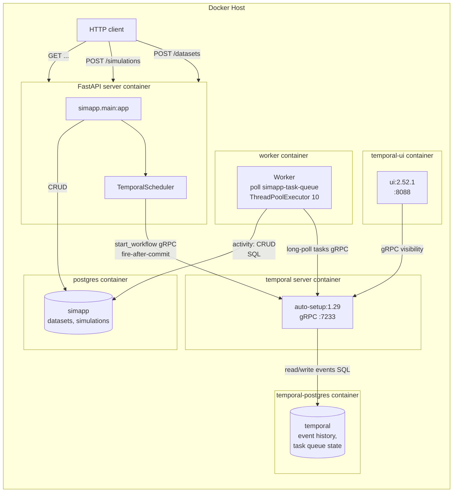

# Temporal Architecture

Deep architectural analysis of the Temporal-based solution for the
simulation scenario. This document covers how Temporal works internally,
what topology we run, how it behaves under failure, and how to operate it
on the open-source Temporal Server and Python SDK.

**Scope:** everything here runs on `temporalio/auto-setup:1.29` plus the
`temporalio` Python SDK. There is no hosted Temporal Cloud, no Enterprise
license. See [`../comparison-report.md`](../comparison-report.md) for the
engine-selection rationale and the reasons Temporal was rejected on this
branch.

The central narrative of this document is the **consistency gap**: Temporal
cannot enqueue a workflow inside the caller's database transaction, so
`feat/temporal` uses a fire-after-commit scheduler that leaves an
orphaned application row whenever the Temporal Server is unreachable at
enqueue time. The proof lives in
[`tests/test_consistency_gap.py`](../../tests/test_consistency_gap.py) and
is reproduced verbatim in §1.7 and §5.

---

## 1. Internal Mechanics

### 1.1 Execution model

Temporal is a **client-server system**, not a library. Three distinct
processes participate in every workflow:

1. **Temporal Server** (the `temporal` container) holds the event history
   of every workflow run in its own Postgres and exposes a gRPC API. It
   never runs application code. It only stores events and dispatches tasks.
2. **Worker** (the `worker` container, our `simapp.temporal_worker`) is a
   long-running process that connects to the Server over gRPC, polls a
   named task queue, and executes workflow and activity code in-process.
3. **Client** (the `server` container, our FastAPI process) calls
   `Client.start_workflow(...)` over gRPC to enqueue a new run.

The traffic pattern is poll-based, not push-based. Workers long-poll the
Server for tasks on their registered queue; the Server hands a task to at
most one poller at a time. There is no message broker. The Server itself
is the broker, backed by its own datastore.

The critical consequence for us: **the application database and the
Temporal database are two separate datastores.** The Server's event
history lives in `temporal-postgres`; the application's `datasets` and
`simulations` rows live in `postgres`. No Postgres transaction can span
both. That separation is the root cause of every limitation in §1.7 and
§5.

### 1.2 The system database

Temporal stores its internal state in a dedicated Postgres instance,
provisioned by `temporalio/auto-setup:1.29` on first boot:

- `temporal-postgres`: user `temporal`, database `temporal`. Holds the
  Server's event-history tables, task-queue state, namespace metadata,
  visibility index.

In our deployment (`feat/temporal` branch) the `docker-compose.yml`
provisions **two** Postgres containers:

```yaml
postgres:
  image: postgres:17.10
  environment:
    POSTGRES_USER: simapp
    POSTGRES_PASSWORD: simapp
    POSTGRES_DB: simapp

temporal-postgres:
  image: postgres:17.10
  environment:
    POSTGRES_USER: temporal
    POSTGRES_PASSWORD: temporal
    POSTGRES_DB: temporal
```

The application never touches the Temporal database directly. It only talks
to the Temporal Server over gRPC, and the Server owns its own schema. This
is the opposite of the DBOS design, where the system tables sit in the
same logical database as the application tables and can be queried
directly for observability.

Key consequence: there is no SQL you can run against the application
database to see workflow state. You query the Temporal Server through its
UI or gRPC visibility API, not by joining `datasets` to a workflow table.

### 1.3 Workflows and activities

A Temporal workflow is an imperative async function annotated with
`@workflow.defn` and `@workflow.run`. An activity is a synchronous or
async function annotated with `@activity.defn`. From
`src/simapp/temporal_workflows.py`:

```python
@workflow.defn
class SimulationWorkflow:
    @workflow.run
    async def run(self, simulation_id: str, dataset_id: str, chunks: int) -> str:
        # Inter-workflow dependency: wait for dataset — retry with 1s backoff
        await workflow.execute_activity(
            wait_dataset_activity,
            args=[dataset_id],
            start_to_close_timeout=timedelta(seconds=10),
            retry_policy=RetryPolicy(
                initial_interval=timedelta(seconds=1),
                backoff_coefficient=2.0,
                maximum_interval=timedelta(seconds=5),
                maximum_attempts=100,
            ),
        )

        await workflow.execute_activity(
            preprocess_activity,
            args=[simulation_id, dataset_id],
            start_to_close_timeout=timedelta(seconds=30),
            retry_policy=RetryPolicy(maximum_attempts=3),
        )

        chunk_results = await asyncio.gather(*[
            workflow.execute_activity(
                simulate_chunk_activity,
                args=[simulation_id, i],
                start_to_close_timeout=timedelta(seconds=30),
                retry_policy=RetryPolicy(maximum_attempts=3),
            )
            for i in range(chunks)
        ])

        import json

        return await workflow.execute_activity(
            postprocess_activity,
            args=[simulation_id, json.dumps(chunk_results)],
            start_to_close_timeout=timedelta(seconds=30),
            retry_policy=RetryPolicy(maximum_attempts=3),
        )
```

Two hard rules come from the replay mechanism (§1.4):

1. **Workflow bodies must be deterministic.** A workflow function is
   re-executed from its event history on every Worker recovery; everything
   side-effecting (DB writes, HTTP, `time.time()`, `random`) must be
   inside an activity so the replay can substitute the recorded activity
   result. The Python SDK enforces this with a sandboxed workflow runner
   that intercepts non-deterministic calls and throws at replay time.
2. **Activities should be idempotent.** An activity that was executing
   when the Worker died will be re-run from its start. Our activities
   satisfy this: `process_dataset_activity` does
   `dataset.status = DatasetStatus.ready` (idempotent),
   `simulate_chunk_activity` is pure sleep+return, and
   `postprocess_activity` overwrites `simulation.result` wholesale.

The fan-out pattern in `SimulationWorkflow.run` is what gives us a runtime
task DAG without a separate DAG compiler. The `chunks` parameter arrives
at execution time and drives `asyncio.gather(*[... for i in
range(chunks)])`. Each `workflow.execute_activity` call is a separate
activity invocation recorded in the event history, so a Worker crash after
3 of 10 chunks completes replays the workflow, sees the 3 recorded
results, and re-issues only the remaining 7.

### 1.4 Recovery: event-history replay

Temporal's recovery model is **replay from the append-only event history**.
Every workflow run has a sequence of events stored in the Temporal
database: `WorkflowExecutionStarted`, `ActivityTaskScheduled`,
`ActivityTaskCompleted`, and so on. When a Worker picks up a workflow that
was in-flight when its predecessor died:

1. The Worker queries the Server for the workflow's event history.
2. It re-invokes the workflow function from the top.
3. For each `workflow.execute_activity` call, it checks the history:
   - If the activity has a `ActivityTaskCompleted` event, the SDK returns
     the recorded result without re-executing the activity code.
   - If the activity has only a `Scheduled` event (it was in-flight), the
     SDK re-issues the activity task, which re-executes the activity code
     from its start. Hence the idempotency requirement.
4. When the re-execution reaches an event not in the history, real work
   resumes.

This is how Temporal gives you exactly-once workflow completion on top of
at-least-once activity execution. The event history is the single source
of truth, and the workflow code is treated as a deterministic function of
that history.

### 1.5 Queues

Temporal's task queue is a named, Server-side buffer of activity and
workflow tasks. Our worker registers one:

```python
worker = Worker(
    client,
    task_queue="simapp-task-queue",
    workflows=[DatasetProcessWorkflow, SimulationWorkflow],
    activities=[
        process_dataset_activity,
        preprocess_activity,
        simulate_chunk_activity,
        postprocess_activity,
        wait_dataset_activity,
    ],
    activity_executor=activity_executor,
)
```

Every Worker that registers `simapp-task-queue` long-polls the Server for
tasks on it. The Server hands each task to at most one poller, so multiple
worker replicas on the same queue load-balance without any client-side
coordination. The `ThreadPoolExecutor(max_workers=10)` bounds concurrent
activity execution inside one worker process to 10.

Because task queues are Server-side, scaling workers is a pure
horizontal operation: bring up another container, point it at the same
`TEMPORAL_ADDRESS`, register the same queue. No schema migration, no
rebalancing.

### 1.6 Inter-workflow dependency: `wait_dataset_activity`

The primitive that makes our scenario work without API-layer polling is a
retrying activity, not an engine-level signal. From
`src/simapp/temporal_workflows.py`:

```python
@activity.defn
def wait_dataset_activity(dataset_id: str) -> str:
    """Block until the dataset is ready. Raises if not — Temporal retries."""
    from simapp.db import SessionLocal
    from simapp.models import Dataset, DatasetStatus

    with SessionLocal() as session:
        dataset = session.get(Dataset, UUID(dataset_id))
        if dataset is not None and dataset.status == DatasetStatus.ready:
            return "ready"
    raise RuntimeError(f"Dataset {dataset_id} not yet ready")
```

The activity queries the application database for the dataset status. If
not `ready`, it raises. The workflow's `RetryPolicy` for this activity
turns that raise into a polled wait:

```python
retry_policy=RetryPolicy(
    initial_interval=timedelta(seconds=1),
    backoff_coefficient=2.0,
    maximum_interval=timedelta(seconds=5),
    maximum_attempts=100,
),
```

So `wait_dataset_activity` is invoked, fails, sleeps 1 s, retries, fails,
sleeps 2 s, retries, fails, sleeps 4 s, retries, fails, then sleeps 5 s
for every subsequent attempt, up to 100 attempts. The simulation workflow
does not poll the API or sleep itself; it simply blocks on an activity
that the engine retries for it.

This is the contrast with DBOS's `get_event`: Temporal has no
engine-level durable signal primitive in this branch. We emulate
"wait for the other workflow" with an application-level poll wrapped in
an activity retry policy. It works because the dataset workflow writes
to the same application database that `wait_dataset_activity` reads, and
because Temporal's retry budget is large enough to outlast the
`process_dataset_activity` sleep.

### 1.7 Transactional enqueue is impossible

This is the central limitation of the Temporal branch and the reason
`feat/temporal` was rejected.

`Client.start_workflow(...)` is a gRPC call to the Temporal Server. The
Server writes the workflow's `WorkflowExecutionStarted` event to the
Temporal database. Neither the gRPC call nor the Server-side write can
participate in the caller's SQLAlchemy transaction against the
application Postgres. Standard Postgres cannot enlist two databases in
one transaction, and even if it could, the Temporal Server is a separate
process that owns its own connection pool.

So the scheduler cannot insert the application row and start the workflow
atomically. The branch uses **fire-after-commit** instead, from
`src/simapp/temporal_client.py`:

```python
def schedule_dataset_processing(
    self,
    session: Session,
    dataset_id: UUID,
    filename: str,
) -> None:
    dataset = session.get(Dataset, dataset_id)
    if dataset is not None:
        dataset.status = DatasetStatus.pending
    session.commit()

    self._ensure_client()
    workflow_id = f"dataset-{dataset_id}"

    self._loop.run_until_complete(
        self._client.start_workflow(
            DatasetProcessWorkflow.run,
            args=[str(dataset_id), filename],
            id=workflow_id,
            task_queue="simapp-task-queue",
        )
    )
```

The sequence is: write the `datasets` row, `session.commit()`, then call
`start_workflow`. Between the commit and the gRPC round-trip there is a
window in which the application row exists but no workflow has been
created. If the Temporal Server is down, the network is partitioned, or
the Worker process is OOM during the gRPC call, the application row is
orphaned: committed, visible to clients, never processed.

The `TemporalScheduler` owns a private asyncio event loop
(`self._loop = asyncio.new_event_loop()`) because FastAPI's request
handler is synchronous but `start_workflow` is a coroutine. The
scheduler runs the coroutine to completion on its private loop, blocking
the request thread. `TEMPORAL_ADDRESS` defaults to `localhost:7233`
and is overridden in `docker-compose.yml` to `temporal:7233`.

`workflow_id` determinism (`f"dataset-{dataset_id}"`,
`f"simulation-{simulation_id}"`) protects against double-submission from
retried HTTP requests: a second `start_workflow` with the same ID is a
no-op on the Server. It does **not** protect against the fire-after-commit
gap, which is a one-sided failure in the other direction.

---

## 2. Our Topology

### 2.1 Services



Six containers run in `docker-compose.yml`: `postgres`,
`temporal-postgres`, `temporal`, `temporal-ui`, `server`, `worker`. Two of
them hold datastores (`postgres`, `temporal-postgres`), two run Temporal
infrastructure (`temporal`, `temporal-ui`), and two run our application
(`server`, `worker`). The application containers talk to Temporal
exclusively over gRPC; the Temporal Server talks to its own Postgres
exclusively. The only thing the application and Temporal share is the
network.

### 2.2 Request lifecycle

**POST /datasets:**

1. FastAPI handler opens a SQLAlchemy session.
2. `INSERT INTO datasets (status='pending')`.
3. `TemporalScheduler.schedule_dataset_processing(session, ...)`:
   - `session.commit()` writes the dataset row.
   - `_ensure_client()` lazily connects to the Temporal Server over gRPC.
   - `start_workflow(DatasetProcessWorkflow.run, id=f"dataset-{id}",
     task_queue="simapp-task-queue")` issues the gRPC call.
4. Return 201 with `{id, status: "pending"}`.
5. The `worker` container's long-poll on `simapp-task-queue` receives
   the workflow task. It executes `DatasetProcessWorkflow.run`, which
   calls `process_dataset_activity`:
   - `time.sleep(2)`.
   - `UPDATE datasets SET status='ready'`.

**POST /simulations:**

1. FastAPI inserts the simulation row (status `pending`) and calls
   `TemporalScheduler.schedule_simulation`. As with datasets, the
   scheduler commits the row then starts the workflow over gRPC.
2. The worker picks up `SimulationWorkflow.run`:
   - `wait_dataset_activity`: opens a SQLAlchemy session, queries
     `datasets.status`. If not `ready`, raises `RuntimeError`. Temporal
     retries with the `1s / 2x / max 5s / max 100` policy until the
     dataset workflow has flipped the row to `ready` or the retry budget
     is exhausted.
   - `preprocess_activity`: `UPDATE simulations SET status='running'`.
   - `asyncio.gather(*[workflow.execute_activity(simulate_chunk_activity,
     args=[simulation_id, i], ...) for i in range(chunks)])`: fans out N
     chunk activities concurrently. Each is a separate activity
     invocation recorded in the event history; each runs
     `time.sleep(1)` and returns `{"chunk_index": i, "value": i*2}`.
   - `postprocess_activity`: receives `chunk_results_json` (a JSON
     string, not a native list, because activities communicate by
     serialization), parses it, sums the values, and
     `UPDATE simulations SET status='completed', result=...`.

### 2.3 Why two datastores

The two-datastore split is not a deployment choice we made; it is a
property of Temporal's architecture. The Server owns its event history
and task-queue state and refuses to share a database with the
application. The benefits are:

- **Isolation.** A misbehaving application cannot corrupt engine state,
  and a busy Temporal Server cannot starve the application's connection
  pool. Engine writes and application writes scale independently.
- **Operational separation.** Temporal can be backed up, restored, and
  versioned without touching the application schema. Engine retention
  policies are independent of application retention policies.

The cost is exactly the consistency gap documented in §1.7. Because the
enqueue RPC lands in a different datastore than the application commit,
no two-phase commit ties them together. Every orchestration engine that
runs as a separate server with its own storage has this property;
Temporal is not unusual here. The DBOS branch is the unusual one, because
it folds the engine state into the application's own Postgres and
thereby gets transactional enqueue for free.

---

## 3. Scaling Path

The architecture scales without redesign, and scales further than the
DBOS branch because the Temporal Server is a horizontally scalable
service in its own right:

| Load increase | Change | Infra delta |
|---|---|---|
| 1 worker (current) | (baseline) | postgres + temporal-postgres + temporal + temporal-ui + server + worker |
| Worker CPU-bound (activities) | `docker compose up -d --scale worker=N` | none, task queue handles distribution |
| Worker CPU-bound (workflows) | Increase `ThreadPoolExecutor(max_workers=...)`, or split chunk fan-out into a child workflow | none |
| Task queue hot spot | Partition by task queue: `simapp-dataset-queue`, `simapp-sim-queue`; register each worker against the queue it specializes in | none, queues are cheap |
| Temporal Server CPU-bound | Run multiple Server replicas behind a load balancer; pin each to a subset of history shards | + Server replicas, LB config |
| Temporal Postgres I/O-bound | Increase IOPS, or shard the Temporal database by namespace across multiple Postgres instances | + Postgres instances |
| Multi-region | Temporal Cloud supports multi-region active-active; self-hosted supports namespace-based pinning | significant, depends on deployment mode |

Throughput ceiling on a single Temporal Server node is in the low
thousands of workflow starts per second, well above the simulation
workload (a few starts per HTTP request). The first real bottleneck is
the Temporal Postgres, not the Server process itself.

One real constraint: **the Temporal Server is a hard dependency.** If
it is down, no workflows can start, no activities can be dispatched, no
recovery can happen. The application's HTTP layer can still read and
write the `datasets` and `simulations` tables directly, but nothing
will progress them. §5 documents this failure mode.

---

## 4. Operating

### 4.1 Recovery playbook

**Normal worker restart** (deploy, OOM, crash): nothing to do. Docker
restarts the container. On startup, the worker reconnects to the
Temporal Server over gRPC, re-registers `simapp-task-queue`, and resumes
long-polling. Any workflow that was in-flight when the previous worker
died is replayed from its event history on the next worker that picks
up the workflow task. Activities that completed before the crash are
skipped (their results come from the history); activities that were
in-flight are re-issued and re-executed.

**Temporal Server restart** (planned upgrade, crash): the Server is
stateless above its Postgres. As long as `temporal-postgres` survives,
the Server restarts, reconnects, and resumes. In-flight workflows are
not lost: their event history is durable. The only visible effect is
that workers cannot poll or report activity results while the Server is
down, so in-flight activity tasks queue on the worker side (up to the
poll timeout) and resume when the Server returns.

**`temporal-postgres` loss**: catastrophic for the engine. Every
in-flight workflow's event history is gone. The application database is
unaffected, so `datasets` and `simulations` rows survive, but no
workflow will resume them. You would need to re-enqueue every
`status='pending'` or `status='running'` row by hand, or via a
reconciliation script. This is the equivalent of losing the DBOS
system database, but here it is in a separate container with its own
backup schedule and failure domain.

### 4.2 Observability

Temporal ships a web UI at `:8088` (the `temporal-ui` container). It
shows every workflow run, its status, its event history, the activity
chain, retry attempts, and stack traces for failed activities. This is
the primary debugging surface for the Temporal branch and is a real
advantage over the DBOS branch, where observability is hand-rolled SQL.

From `docker-compose.yml`:

```yaml
temporal-ui:
  image: temporalio/ui:2.52.1
  depends_on:
    - temporal
  environment:
    TEMPORAL_ADDRESS: temporal:7233
    TEMPORAL_CORS_ORIGINS: http://localhost:8088
  ports:
      - "8088:8088"
```

For programmatic access, the SDK exposes
`client.list_workflows(...)` and
`client.get_workflow_handle(id).describe()` for status queries, and
`client.get_workflow_handle(id).query(...)` for workflow-defined
queries. There is no SQL surface on the application database that
reveals workflow state, because that state lives in the Temporal
database, which the application does not touch.

### 4.3 Versioning of workflow code

Workflow code changes break in-flight replays. The event history
records which activities were scheduled in what order with what
arguments; the replay re-invokes the workflow function and expects to
re-derive the same schedule. If you change the workflow to schedule a
different activity, reorder the calls, or change the arguments, the
replay detects a non-deterministic change and fails the workflow with a
`WorkflowNondeterministicError`.

The Python SDK's sandboxed workflow runner catches the most common
mistakes (calling `time.time()`, `random.random()`, `print`, blocking
I/O) inside a workflow body and throws at replay time. The SDK also
provides replay-safe substitutes: `workflow.now()`, `workflow.random()`,
`workflow.uuid4()`. Anything not in that list that depends on the
outside world must be in an activity.

Our mitigation on this branch:

- Treat the workflow body as a versioned contract. Once a workflow is
  in-flight, the deployed code that started it must remain deployable
  until it completes or is terminated.
- For changes that must ship while workflows are in-flight, use the
  SDK's patching primitives (`workflow.patched(...)` and
  `workflow.deprecate_patch(...)`) to gate new behavior behind a
  marker that old histories will not have.
- For development, accept that in-flight workflows will fail and need
  re-submission. They are visible in the Temporal UI as `FAILED` and
  can be re-run from the UI or via the SDK.

### 4.4 Idempotency table

Every activity must be safe to re-execute, because the engine may
re-issue it after a Worker crash or a `StartToClose` timeout.

| Activity | Idempotent? | Why |
|---|---|---|
| `wait_dataset_activity` | ✅ | Pure read; raising is safe to repeat |
| `process_dataset_activity` | ✅ | `UPDATE datasets SET status='ready'`, same result on retry |
| `preprocess_activity` | ✅ | `UPDATE simulations SET status='running'`, idempotent state transition |
| `simulate_chunk_activity` | ✅ | Pure sleep+return |
| `postprocess_activity` | ✅ | Overwrites `simulations.result` wholesale; `json.loads` is repeatable |

If we ever add "append row," "send email," or "call external API"
activities, they need their own dedup mechanism keyed on the workflow
run ID plus the activity invocation sequence, because Temporal will not
deduplicate them for us.

---

## 5. Failure Modes

| Failure | Behavior | User-visible effect |
|---|---|---|
| Server crash mid-request | The `session.commit()` succeeds; `start_workflow` gRPC fails | Client sees HTTP 500, but the row is already committed, **the orphan gap** |
| Worker crash mid-activity | Activity task re-issued on worker restart; activity re-runs from start | Simulation takes a few extra seconds |
| Worker crash between activities | Workflow replayed from event history; completed activities skipped | No visible effect |
| Temporal Server down | `start_workflow` raises; HTTP 500 returned; row is orphaned | Visible immediately on the next request |
| Temporal Postgres restart | Server reconnects, workers resume polling | Brief delay; nothing lost |
| `temporal-postgres` loss | All in-flight workflow state lost | Catastrophic; requires manual reconciliation of `pending`/`running` rows |
| `wait_dataset_activity` timeout (100 attempts) | Activity fails, workflow fails (no workflow retry by default) | Simulation stays in `running` forever; needs reconciliation |
| Duplicate enqueue (e.g., client retry) | Second `start_workflow` with same `id` is a no-op | None, idempotent by workflow ID |
| Non-deterministic workflow code change | Replay throws `WorkflowNondeterministicError`, workflow marked `FAILED` | Visible in Temporal UI; needs patching or re-submission |

The headline failure mode is the **orphan gap**, which
`tests/test_consistency_gap.py` proves is real and reachable. The test
patches `Client.connect` to return a mock client whose `start_workflow`
raises `RuntimeError("Temporal server down")`, then asserts both that
the HTTP response is 500 and that the dataset row was committed anyway:

```python
async def _fake_connect(*args, **kwargs):
    from unittest.mock import AsyncMock

    mock_client = AsyncMock(spec=Client)
    mock_client.start_workflow = AsyncMock(side_effect=RuntimeError("Temporal server down"))
    return mock_client

with patch("temporalio.client.Client.connect", side_effect=_fake_connect):
    with open(filepath, "rb") as f:
        response = gap_client.post("/datasets", files={"file": ("test.csv", f, "text/csv")})

    assert response.status_code == 500, (
        f"Expected 500 when Temporal is down, got {response.status_code}"
    )

# Verify: the dataset row EXISTS in the DB despite the workflow failure
engine = create_engine(settings.database_url, pool_pre_ping=True)
with engine.connect() as conn:
    result = conn.execute(
        text("SELECT count(*) FROM datasets WHERE filename = 'test.csv'")
    )
    count = result.scalar()
    assert count == 1, (
        f"Expected exactly one orphaned dataset row (the gap) but found {count}"
    )
```

The test uses `gap_client`, a fixture defined in `tests/conftest.py` that
deliberately does not override `get_scheduler`, so the real
`TemporalScheduler` runs and the patch reaches the gRPC layer. The
`client` fixture, by contrast, swaps in `StubScheduler`, which processes
workflows inline in background threads and never touches the Temporal
Server.

The `wait_dataset_activity` timeout is the second rough edge. After 100
attempts the activity fails, the workflow fails, and the simulation row
is left in `running` because `postprocess_activity` never ran. Options:

1. Wrap the `wait_dataset_activity` call in a try/except inside the
   workflow and have a failure-path activity write a failed status to
   the simulations table (deterministic, owned by us).
2. Run a reconciliation job that scans the application database for
   `status='running'` simulations whose Temporal workflow has no live
   run, and marks them failed.
3. Surface the timeout UX-side.

None of these are implemented on this branch. They are flagged as
follow-up work.

---

## 6. Comparison With What We Rejected

The Temporal architecture on this branch is the canonical
"orchestrator server" pattern. The table below compares it against the
other engines evaluated in [`../comparison-report.md`](../comparison-report.md):

| Component | **Temporal** | DBOS | Prefect | procrastinate | Outbox+CDC |
|---|---|---|---|---|---|
| Orchestrator server | ✅ required (`temporal` container) | no, library | ✅ required (`prefect-server`) | no, library | no, pattern |
| Message broker | internal (Server poll) | Postgres | internal | Postgres | Postgres + CDC stream |
| Result/history store | own Postgres (`temporal-postgres`) | app Postgres | own Postgres | app Postgres | app Postgres |
| UI/dashboard | ✅ `temporal-ui` :8088 | Conductor (paid) | ✅ Prefect UI | no | no |
| App database | yours (separate) | yours (shared) | yours (separate) | yours (shared) | yours (shared) |
| Transactional enqueue | ❌ impossible (separate datastore) | ✅ `enqueue_in_transaction` | ❌ | ✅ `defer_function` in-tx | ✅ by construction |
| Extra infra services | 4 (server, UI, pg, worker) | 0 | 2 (server, pg) | 0 | 1 (CDC) |
| Determinism enforcement | sandboxed runner | discipline on you | discipline on you | n/a (tasks, not workflows) | n/a |
| Cross-language | ✅ gRPC clients in many languages | Python only | Python only | Python only | any |
| Recovery model | event history replay | checkpointed steps | task retries | task retries | row replay |

The two columns that decided the engine selection are **Transactional
enqueue** and **Extra infra services**. Temporal has the strongest
runtime story (durable replay, sandboxed determinism, a real UI,
cross-language support) and the weakest scheduling story (no
transactional enqueue, four extra containers). For this project the
scheduling story won, because the simulation workload is short and
single-language and the consistency gap is unacceptable for an
API-facing system.

---

## 7. Known Tradeoffs

Honest list, so we are not surprised later:

1. **No transactional enqueue.** This is the decisive tradeoff. Any
   application row that needs a workflow must be committed before the
   workflow starts, leaving a window in which the row exists without a
   workflow. `tests/test_consistency_gap.py` proves this window is
   reachable with a trivial mock. Closing it requires either an Outbox
   table plus a CDC relay (defeats the purpose of using Temporal's
   scheduler) or application-level reconciliation (defeats the purpose
   of using a durable executor).

2. **Heavy infrastructure.** Four extra containers (`temporal`,
   `temporal-ui`, `temporal-postgres`, `worker`) on top of the
   application's own `postgres` and `server`. Each one has its own
   health check, log volume, upgrade cadence, and failure mode. For a
   single-process simulation workload this is a lot of moving parts.

3. **Determinism sandbox.** Workflow bodies cannot use `time.time()`,
   `random.random()`, blocking I/O, or threading. The SDK's sandbox
   catches most violations at replay time, but the constraint is real
   and shapes how you write code. `workflow.now()`,
   `workflow.uuid4()`, and `workflow.random()` are the sanctioned
   substitutes. Activities carry the side effects.

4. **Learning curve.** Temporal's concepts (workflows vs activities,
   signals vs queries vs updates, retry policies, timeout taxonomy,
   parent-close policies) are more numerous than any of the rejected
   alternatives. Onboarding a new engineer takes longer.

5. **Separate datastore for engine state.** Observability of workflow
   state requires the Temporal UI or the gRPC visibility API, not a SQL
   query against the application database. This is fine for engineers
   but awkward for support staff who already have SQL access to the
   application schema.

6. **Event history growth.** Every activity invocation, every retry,
   every signal appends to the event history. Long-running workflows
   with many activities (our 1000-chunk fan-out is a mild case) grow
   histories that the Server must load on every replay. Temporal
   supports workflow retention and history truncation, but the
   defaults need tuning for production.

7. **`wait_dataset_activity` retry budget is finite.** The 100-attempt
   cap with a 5 s ceiling means the workflow gives up after roughly 8
   minutes of waiting. If `process_dataset_activity` takes longer than
   that (slow disk, contention), the simulation workflow fails and
   leaves the row in `running`. Tuning `maximum_attempts` higher trades
   off against longer failure detection.

8. **Workflow versioning discipline.** Shipping a workflow code change
   while workflows are in-flight requires the SDK's patching
   primitives. There is no automatic way to evolve a workflow; every
   change that affects the event schedule must be gated behind
   `workflow.patched(...)` or it breaks replays.

---

## 8. Decision

For this project, the Temporal branch is **not** the recommendation.

The runtime story is excellent: durable replay, a sandboxed
determinism checker, a real UI at `:8088`, cross-language support,
horizontal scaling of both workers and Server. These are real
advantages and they are why Temporal was a serious candidate.

The scheduling story is disqualifying for this workload. There is no
transactional enqueue, the proof is one mocked test away, and the gap
is one-sided in the worst direction: a committed application row with
no workflow. For an API-facing system where clients read back their own
rows, an orphaned dataset is a visible correctness bug. Reconciliation
infrastructure (Outbox, CDC, or a sweeper job) would be needed to close
it, and at that point the simplicity argument for Temporal evaporates.

The recommendation is:

- ❌ Do not adopt `feat/temporal` as the reference implementation.
- ✅ Keep the branch for reference. The Temporal UI and the
  `test_consistency_gap.py` proof are useful artifacts for explaining
  the consistency-gap failure mode to future reviewers.
- ✅ Adopt `feat/dbos` instead. Its transactional enqueue closes the
  gap that `feat/temporal` cannot, with no extra infrastructure.
- ⏸️ Re-evaluate Temporal if the project ever needs cross-language
  workflows, multi-region active-active orchestration, or human-in-the-loop
  workflow intervention (Signals, Updates, pause/resume). At that scale
  the infrastructure cost is justified and a separate datastore becomes a
  feature, not a bug.
